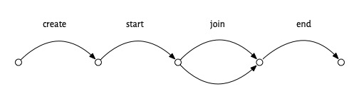
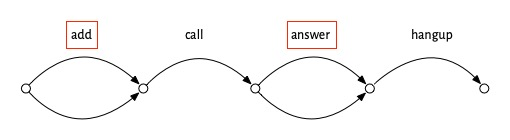

# How to Design Software

## A new year, a new take
It’s been just over two years since the publication of *The Essence of Software* (EOS). In that time, engaging with readers, consulting and teaching to students and practitioners has given me a new perspective on concept design.

In this series of notes, I hope to share some of the respects in which my understanding has evolved. In addition to having a better sense of what matters most, I think I have a greater appreciation of the obstacles that make concept design seem (at the same time!) trivial to some and obscure to others. I also hope to point to some exciting new directions for concept design---in particular how concepts make it easier to exploit LLMs for generating code.

## What is software design?
As I explain in EOS, I’ve coopted the term “software design” to mean something different from what most people in the software world expect. To me, it means designing *function*: how the software will behave and interact with its users and the world. 

So the design of the software is what determines whether or not it fulfills the user’s needs, because if the function is wrong (or confusing), the user won’t be happy. The user interface matters too, but that’s a separate issue (of how the design is presented).

What I particularly do *not* mean by software design is how the *code* is structured. That’s important, but more for the programmer than the user. It will turn out that concept design influences code design, but that’s not my focus here.

Why is it important to reclaim the term “software design”? Why not just call this “product design” or “UX design”? The problem with those terms is that they reinforce the way in which software design is typically siloed into different roles in a company, even though it usually involves people across all of them---and in other roles too (such as software engineering and architecture). I want to advocate for the centrality of software design in shaping the experience of users, just as Mitchell Kapor did in his manifesto 25 years ago.

# Building on good ideas

Concept design builds on many familiar ideas. To mention a few:
- From **use cases and user stories**, concept design takes the idea that software interacts with the world through scenarios that deliver value.
- From **user-centered design** (as taught by Don Norman in *The Design of Everyday Things*), concept design takes the idea that the user interface is a kind of apparition (a “system image” in Norman’s phrasing) that stands between the user and the system, revealing only indirectly the underlying reality. When the user’s understanding (their “mental model”) is not aligned with this reality (the “conceptual model”), the system becomes unusable.
- From **domain-driven design** (and its predecessors, such as OMT and JSD), concept design takes the idea that the most stable part of a system’s function may be grounded in structures that already exist in the problem domain.

In each of these cases, concept design goes in new directions. Unlike use cases, the scenarios of concept design are not used as specifications. Whereas user-centered design focuses on building the system image that connects the conceptual model to the mental model, concept design focuses on the conceptual model itself. And while domain-driven design looks for existing structures in data, concept design looks for them in function.

More fundamentally, concept design is about making the function of software *modular*: that is, dividing it into separable chunks that can be understood independently. Modularity is the key to many good things: separation of concerns, division of labor, reuse, decoupled implementation, etc. 

To achieve modularity, concept design draws on well-established ideas from computer science (in particular the idea of [state machines]() and the idea of composing processes by [synchronizing actions]()).

What about objects and classes? Given objects’ success in programming, and their use in simulations for modeling domains, you might have expected them to be the right modularity mechanism for concepts too. But as we’ll see, objects aren’t a good fit for structuring function.

# A path to better software design

If we want to make software that’s successful, it helps to start by looking at examples of success. So we’ll consider some well known examples and try and identify what made them succeed: their secret sauce. 

When you try to figure what made some app super successful, and you ask users why they like it, they’ll often say “because it just works.” Uncovering what this is about---what “just working” really means---is not so easy, but I think it’s possible to identify the key elements of “just working” and I’ll lay them out here.

So let’s start by look at an app and trying to understand why it succeeded.

# How Zoom killed Skype
In 2019, Skype had four billion registered users, and about a third of the video call market. Then the pandemic hit. Zoom, a product few had even heard of, took off and “zooming” became a household word. By 2021, Zoom had half the video call market and almost a billion dollars in revenue, and Skype has receded out of view.

Zoom is one of those apps that people say “just works.” Let’s think about how Zoom works, from a user’s perspective. You *create* a meeting, which generates a link you share with your friends. Then, you *start* the meeting and your friends can *join* in their own time, using the link you gave them. When you’re done, you *end* the meeting. We can depict this scenario in a diagram showing the actions taken, with forking arrows in the joining step to suggest that multiple people can join in whatever order:

Now compare this to using Skype. To set up a group video call in Skype, you *add* each of your friends to the group, then you *call*, some of them *answer*, and then you *hangup*:

At first blush, this doesn’t look any worse. It’s not more complicated in terms of the number of steps or the structure of the scenario. The problem is that some of the steps, which I’ve outlined with red boxes, are painful. Adding your friends means going through your contact list and finding them one at a time. If one of your friends isn’t in your contact list, you’ll have to get their contact info and include it. Even worse, if one of your friends isn’t a Skype user, you won’t be able to invite them at all. The answer step isn’t so easy either. Your friend has to open the app and either be there at the moment that your call comes in, or has to find a notification that they missed.

Now, you might say this is all silly. If you just want to talk to two friends and they’re already on Skype, it will work just fine. And you’re probably right. But what happened in the pandemic was that things changed, and suddenly people wanted to talk to all kinds of different groups of people---friends, colleagues, neighbors---and in larger numbers than before. So the small annoyances of Skype became huge barriers.

In that context, Zoom’s solution was what Merrick Furst calls a “not not.” It was *not* OK to *not* have the Zoom scenario, which allowed you to organize  a meeting merely by sharing a link, and to join a meeting just by clicking on it, whether or not you had a Zoom account.

# Not quite so simple

Now you may be thinking: that’s not the whole story. And you’d be right. The switch from Skype’s *video call* scenario to Zoom’s *meeting* scenario wasn’t so sudden or clear cut.

The Zoom idea (having a meeting link created asynchronously in advance) might have originated with LogMeIn in 2010, a company that built a video conferencing solution that was aiming to be much more lightweight than existing offerings from companies like Citrix. Zoom used this idea from its founding in 2012, but by 2020, it wasn’t the only company to have recognized its value. Skype added meeting links in 2015, and Google Hangouts had them a year later.

But in both those cases, the idea was integrated half-heartedly. It wasn’t the default way to start a meeting. In Skype you couldn’t link to a video call directly (but only to a chat, from which a video call could be launched). And in Hangouts, although the host could admit users without accounts, they had to be approved (as in Zoom’s “waiting room”), a nuisance for a large (and not private) meeting.

There are other complications too. Zoom’s success undoubtedly benefited from the ease of installing the app, which relied in part on disreputable techniques (learned these from malware developers) for working around operating system protections that would have required additional approval steps from the user. Zoom also lied about end-to-end encryption. These factors seems smaller, however, than the others.

# What “just works” means

With all this in mind, we can now pose the question: what did people mean when they said that they switched to Zoom because it “just works”?

First, it seems to me, “just working” applies to products that one expects to be targeted at a relatively simple purpose and to work in a (correspondingly) uncomplicated way. A video calling app fits these criteria, but not a photo editing app. I don’t think anyone expects that Photoshop should “just work.”

Second, it means that the product should have a clear and compelling usage scenario: that it’s obvious what steps you have to take, and in what order. Zoom makes this very easy, because there are so few steps, and at any time, you have very few options. So having created meeting, you can’t do much except start it; and having started or joined it, there’s nothing to do except leave. (Of course, there are other actions you can take, like muting your microphone, but it’s pretty obvious that those are orthogonal to the main meeting scenario).

Third, when you execute the scenario you shouldn’t encounter pain points, like having to find contacts to add to a group call in Skype, or having to open an account to respond to a call invitation.

# The operational principle

Using a term coined by Michael Polanyi (and brought to software engineering by Michael Jackson), I call a scenario that explains how a product “just works” its *operational principle* (OP).

The operational principle is just a sample scenario, but it includes enough richness to convey typical usages. The example I gave above for Zoom could be written in a more textual way like this

	<create, start, join+, end>

where *join+* means one or more *join* actions. Another scenario would be this

	<create, start, end>

in which the meeting is started but nobody joins, so the poor host ends it without talking to anyone. That’s a perfectly *valid* scenario, but it’s not *useful*, so it wouldn’t count as an OP.

Another example: To use a traditional elevator, you call it (by pressing the up or down button), you enter the first elevator that arrives, select your floor, and exit when you arrive:

	<call, enter, select, exit>

Some modern elevators work differently: you select the floor in the elevator lobby, enter the elevator at the indicated bank, and then exit at your floor:

	<select, enter, exit>

Note that we could enrich the OP to make it clear that you have to enter the correct elevator, writing something like

	<select(f):b, enter(b), exit(f)>

to say that when you select floor f, the system responds with elevator bank b, and you then enter an elevator in bank b, and exit at floor f. Likewise we could have indicated that the participants in our Zoom meeting use the link it was started with:

	<create():m, start(m), join(m)+, end(m)>

A restaurant reservation system lets you reserve a table, then start using it at the prescribed time, and then end using it some time later:

	<reserve, start, end>

(How much later the end action might occur is a difficult design challenge: if diners stay too long, the restaurant fails to deliver on its OP, but if the reservation slot is longer than necessary, tables will sit empty.)

The OP of a software app represents its innovative essence. Some OPs were invented just for software (or for computerized systems)---the elevator’s, for example. Many, like the restaurant reservation OP, were invented as a social protocol that existed long before computers (back in the 19th century, in fact). And some, like Zoom’s, are a kind of hybrid: naming a meeting place in advance is not so different from what people have always done when they say “let’s meet at the pub at 7pm” (although, unlike the pub, Zoom’s meeting place is created on demand from an unlimited pool).

The non-obviousness of an OP may be a symptom of cleverness: the elevator that begins with floor selection, for example, allows better load balancing (by directing travelers to particular elevators).

But a trivial OP can be a significant innovation too. Take the OP for blogging platforms, which is little more than this:

	<post, read+>

That is, the blogger posts an article and then multiple people read it. This seems almost too silly to specify. But it’s more subtle than it seems. The action of reading an article involves specifying 

how is selection specified???

someone performs a read, they 

 read actions are  read 

 actually relies on a 

 the converse doesn’t hold: a trivial 

it’s a mistake to think that a trivial OP is evidence of no ad

don’t be the converse is not true

iPod

	pay, park, leave

all these OPs have interesting subtleties
if a one space zone, don’t need car license (but they may still ask so they can prevent you sharing?)

If you don’t believe that use is part of the system, see what happens if you make lots of OpenTable reservations and don’t turn up.

OPs are often computerizations of social protocols. parking, reservations, calls, meetings in places.

Can describe socio-technical systems too.
The OP for social security:

	<assign, contribute+, retire, withdraw+>

>as a simple sequence 

Comparisons
drinking band to simple age verification
Can be very simple, novelty is in comparison to more complex one. Social media posting.