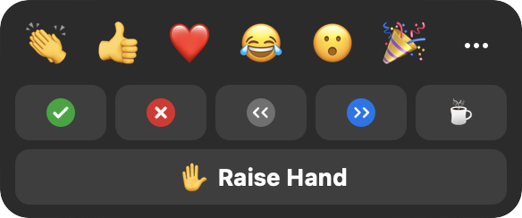

# Smooth Software

In an old interview, unfortunately no longer online, Jony Ive explained how his team at Apple had designed the MacBook's rounded corners. "I suppose that's pretty obsessive, isn't it?" he ended, with a self-deprecating smile.

It struck me as a perfect metaphor for software design: that so often the real work is in the smoothing of rough edges. Each small protrusion and snag may seem inconsequential by itself, but in aggregate  they create a constant stream of irritation and confusion for the user. Focusing on them may seem obsessive, but the result can be dramatic. As the Eames told us, the details are not the details: they _are_ the design.

Concept design offers a new way to smooth the edges in software. In this post, using Zoom as an example, I'll explain some simple tactics for identifying and eliminating rough edges.

## Zoom's Reaction Concept
To illustrate the tactics, let's take a look at Zoom. When analyzing an existing application, we should bear in mind that its concepts may not be readily apparent.

In a well-designed app, the concepts will be _mapped_ straightforwardly to user interface elements, but this is not necessarily so (especially for subtle concepts). Nevertheless, when evaluating an app, it makes sense to start by assuming that the key concepts are aligned with the primary features as they present themselves to users.

So we'll assume for now that the prominent button labeled _Reactions_ corresponds to a concept, and we'll treat it as such for now. 

Notice that there are three rows of buttons: (a) the top row, comprising emojis such as clapping, thumbs up, etc; (b) the middle row with yes and no buttons, left and right arrows, and a coffee cup symbols; and (c) the bottom row with a single "raise hand" button.

## Anomalies in Reactions

Clicking on any button, irrespective of the row, causes the corresponding icon to appear in your box in the  grid, as you'd expect. What might not be so obvious is that the different buttons behave in slightly different ways.

First, there's a disappearing effect on some. Clicking on a button on the top row makes the emoji appear but disappear automatically after about ten seconds; this doesn't happen with the buttons on the other rows.

Second, there's an undo action for some. Clicking any button also produces a small icon above the Reactions dialog; for all but the emojis, these icons turn out to be buttons you can click to turn off the effect.

Third, the buttons enforce some disjointness rules. The top row buttons operate as a radio button group; clicking any one replaces another (if it hasn't yet disappeared). Likewise, the middle row is a group. Surprisingly, the Raise Hand button in the bottom row belongs to this group: if you've clicked the check mark, for example, clicking the Raise Hand button will make it go away.

## Anomalies in Search of Purposes
Having identified these anomalies, our next step is to try and justify them—essentially reverse engineering the designer's rationale.

Let's think about purposes. The Reactions concept as a whole has a simple purpose: to allow users to convey common and straightforward feelings in a lightweight fashion. Digging more deeply, though, we can identify different sub purposes with each row. 

The top row lets users convey emotions, presumably in reaction to something said or shown by someone else. For the middle row, it's hard to find a single subpurpose. The yes/no buttons are for responding to questions from the speaker; the arrow buttons are to suggest that the speaker slow down or speed up; and the coffee cup button is used to indicate that the user is away from the meeting. The Raise Hand button is to indicate a desire to speak.

With these more refined purposes, we can now consider the anomalies and see if they make sense.

The disjointness rules are plausible: for example, you wouldn't want to tell a speaker to slow down and speed up at the same time. The automatic disappearance is reasonable, too: clapping, for example, is a momentary gesture and it might be annoying to have to turn it off.

But when we examine these more closely, we see that there are some problems. It makes sense that speed up and slow down are disjoint, and that laughing and crying are too. But why can't you clap and send a heart at the  same time? And why does stepping away make your yes/no response disappear? And raising your hand cancel your request that the speaker slow down or speed up?

## Fixing Anomalies
The variant behaviors (in automatic disappearance and disjointness) save the user some trouble, but at the expense of limiting flexibility. In some cases, the flexibility is minor: being able to send more than one emoji at a time, for example. But in others, it's more significant. I can't imagine  that any speaker really wants responses to a poll to disappear when participants raise their hands.

This suggests a concept design that lets the developer adjust the rules over time. Rather than hardwiring the fact that claps disappear but yes/no answers don't, we could design the Reaction concept with an action  _makeDisappearing (reaction)_, which, when executed, causes a particular reaction to become a disappearing one. In a preamble in the code, a series of calls can then configure the reactions to be disappearing or not. 

A similar strategy can be applied to disjointness: an action _addToGroup (reaction, group)_ might add a reaction to a radio button group with the effect that all reactions in the group are mutually disjoint.

With this richer concept in hand, it would be easy to fix the problems in Zoom. We can assign the yes and no reactions to one group, and the slow down and speed up reactions to another.

It would be interesting to know if the  design of Zoom already incorporates this more flexible concept, or if the programmers have instead hardwired a collection of behaviors (which might explain why what seem to be some undesirable cases have not been fixed).

More controversially, one could even expose these configuring actions to users, letting each decide what behavior they want. 

Another possibility is to simply eliminate the anomalies. We could design the concept with two distinct actions: _toggleReaction (reaction)_, which turns a reaction on or off;
and _transientReaction (reaction)_, which shows a reaction for ten seconds or extends it for ten further seconds if it's already showing. One could map these actions to the user interface in clever ways: perhaps a double-click is a _toggleReaction_ and a single-click is a _transientReaction_.

Of course, such a design introduces its own complications. I'm not insisting on this design, but merely illustrating the range of possibilities.

Likewise, the disjointness rules could be replaced by a uniform mechanism. Making it possible to toggle emoji too, for example, would make disjointness less essential there.

## Doubling Down: Expanding Differences

When you encounter an anomaly in a design, one response is to try and minimize it or even eliminate it. But the opposite response may be more valid: to actually expand it. If differences are justified by purposes, maybe we should actually _amplify_ them. Paradoxically, we'll see that this might let us make things simpler and more uniform.

Having noticed that the reactions behave differently, we identified at least two different subpurposes: sending emotional reactions (clapping, smiley faces, etc) and providing feedback (slow down, speed up, etc). One difference between these is that reactions in the first class disappear automatically. 

Recognizing these distinct purposes, we might now wonder whether they suggest additional differences in behavior.

First, we might consider differences of audience: perhaps feedback should be shown only to the speaker; a student in a class might not want to share with all the other students a request that the lecturer slow down. And perhaps users would like to select the targets of their emoticons, sending a heart to just one favorite participant, say. 

Second, noticing that the participant window shows counts for reactions:

we might decide to only count some kinds of reaction. Counting how many participants replied yes vs. no, or how many said speed up vs. slow down makes sense. But do we need a count of the number of participants who have sent hearts?

Third, we might consider differences in interactions with other concepts. Perhaps emotional reactions should be included in the chat window, for example, the way they are in Slack:

## Even Larger Differences: Concept Splitting

Beyond expanding in these small ways, we might consider larger ones. The Raise Hand function seems to be in a different category from the others, because of the role it plays in negotiating who's speaking. People often forget to lower their hands, making us wonder if a new concept is called for that manages the queue of requests to speak, letting a moderator select the next speaker and automatically lower their hand.

Just as we noted that the emoticon reactions might be absorbed in a more conventional reaction concept attached to Chat, so the "I'm away" button brings to mind the concept of Presence in social media apps such as Slack, in which a user can indicate their availability and willingness to participate. 

All these analyses take us towards splitting the Reaction concept into multiple independent concepts (EmotionalReaction, Feedback, Moderation, Presence, etc). These need not be new: in almost all cases, there are rich examples of these concepts in other apps to draw from and perhaps to adopt unchanged.

The Feedback concept is what you might call a _fledgling concept_ in Zoom. It's not quite there, but there are hints in various places that the developers have such a concept in mind. There is a "clear all feedback" action in the Participants window; unfortunately, the word "feedback" does not appear in the Reaction window so it will be unclear to most users that it refers to all but the first row of reactions. And it's strange that "I'm away" and a raised hand are treated as feedback, so when this action is executed, those flags disappear too.

In one case, there's an overlap with another concept in Zoom itself. The yes/no buttons are surely intended to support a quick poll. So why doesn't the Poll concept let you create a quick ad hoc poll, in addition to a standard poll (which is a more heavyweight thing, demanding a title, allowing only multiple-choice-style and not yes/no questions, and requiring an explicit launching step)?

## Summary of principles and tactics
Let's summarize the approach I've described. It's guided by a few key principles:
1. Irregularities, or differences between similar features, usually impose a cognitive burden, because there's more to understand than when things behave the same way. Simplicity therefore suggests eliminating irregularities and a preference for uniformity.
2. An irregularity may, however, serve a legitimate purpose, and its value may exceed the cost of the irregularity per se. So any evaluation of irregularities must make purposes explicit.
3. For each irregularity, then, we must determine whether it is justified (and should be tolerated) or not (and should be eliminated). If justified, we should ask whether the irregularity is _sufficient_ to support the purpose that motivates it, or should even be extended.
4. A concept can accommodate a certain amount of irregularity in its design, especially if the irregularity can be organized in a systematic and generic way. 
5. In many cases, it may be better to create new concepts for each of the variant forms of behavior rather than attempting to contain them within a single concept. This makes it easier to adopt familiar concepts (to the extent that they apply) and to contain the development of more ad hoc behaviors.

And here's a summary of tactics:
1. If you starting with an app you designed with concepts, you know what your concepts are. If not, start by treating the major areas of functionality, as evident in the user interface, as the concepts. 
2. Analyze each concept and consider whether the functionality it offers is uniform or contains irregularities.
3. For each irregularity, try to justify it by recognizing differences in purpose. If you can't find any such differences, the irregularity should probably be eliminated. 
4. Think about how you might support the differences systematically, by enriching the concept definition with new actions or state that can support the differences and maintain the concept's genericity (and thus its applicability in other contexts). This is also a helpful step in developing a compelling explanation of the differences; we did this for Zoom's Reaction concept by adding the notion of a "reaction group."
5. Consider expanding differences even further to better support any distinct purposes. This likely leads to recognizing new concepts. Rather than creating concepts afresh, consider whether the new concepts might be instances or variants of familiar ones.

## The Big Picture
A diagram showing the tactics
Flaws, incentives to look in the first place etc
 we applied are straightforward

