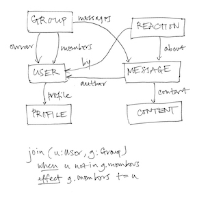
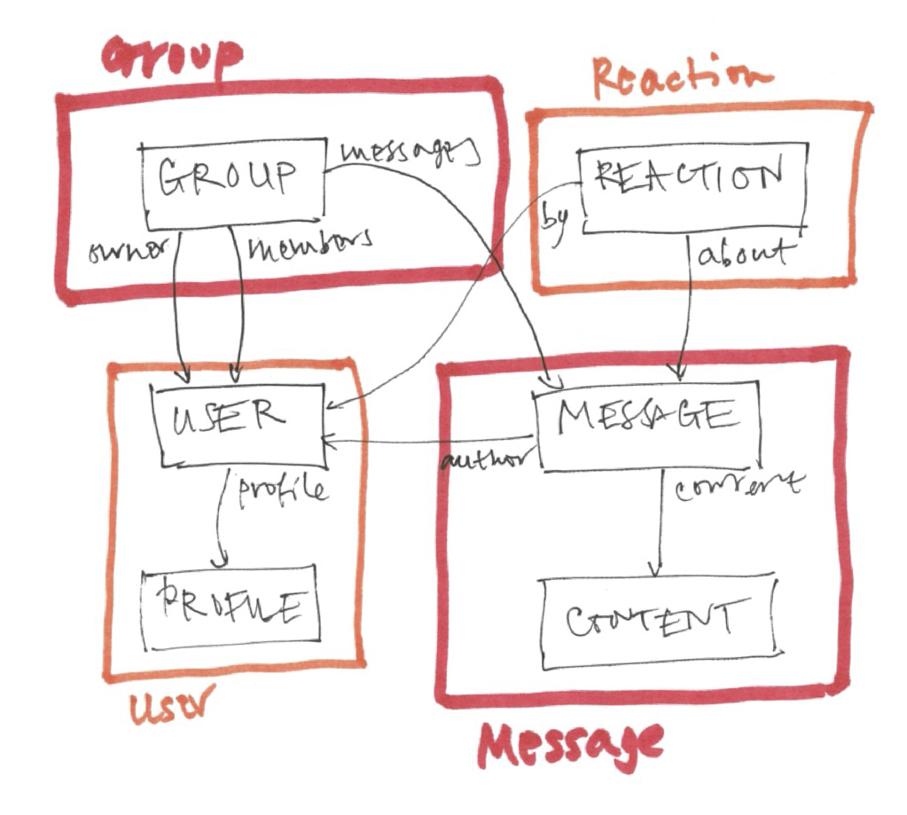
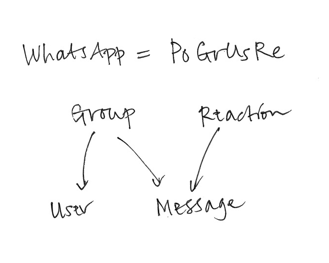

I've spent the last ten years or so looking at hundreds of apps, trying to figure out what software design is all about. The result of my explorations is *concept design*: a new lens for thinking about software, how it’s designed, constructed and used.

Viewing software design through this lens can improve the quality of the software you build, for both developers and users, and bridge the gap between UX and engineering (which are often [siloed](https://essenceofsoftware.com/posts/ux-design-silo/) into different roles). You can think of it as a computational take on UX design. 

I call it a “new” lens, because adopting it dramatically changes the way most software design happens. But in some sense, it's not new at all. It just makes explicit what I suspect the best designers have always done, and it distills some ideas that have been floating around for a long time.

I’ll explain concept design in three stages, each of which suggests adopting a different perspective on design from the conventional one. 

## Stage One: Design = Functionality

Stage One is the least radical, but it’s important to grasp it before moving on: _view the design of software as the shaping of its functionality_.

This might sound obvious, but it’s not what people actually do. Functionality is what the software does, not how it does it (which is what software architecture is about), or how it’s presented (which is what UI design is about). It’s the most basic starting point, because you can’t think about code until you know what function it should implement, and you can’t think about a UI until you know what functions the UI should support. In practice, the functionality is often implicit and apps are “designed” by starting with code sketches or wireframes. Being explicit about what we’re actually [designing](https://essenceofsoftware.com/tutorials/design-general/design-vs-engineering/) is the first stage.

So imagine we’re designing a social media app—call it *WhatsUp*—that lets users post messages in groups. As we’re evolving the design, we’ll need a way to describe the functionality we have in mind (without resorting to UI sketches and nudge-nudge-wink-wink you-know-what-I-mean). How do we do that?

We could start by defining the set of states: there are users, groups and messages; messages are from users and divided into groups; users can belong to multiple groups. We can explore these states more precisely by considering possible invariants (“integrity constraints” in database lingo) as design questions: must a message belong to exactly one group? must a message be from a member of the group it’s in?

Then we can list actions that users can perform. A user can: *create*, *delete*, *join* and *leave* a group; *post* a message to a group; *reply* to a message; etc.

_States and an action for WhatsUp_

The beauty of this scheme is that just by writing down the state and invariants you’re describing a whole set of possible behaviors. A seemingly straightforward invariant can have subtle consequences on behavior which a good designer can infer, so the design of the state becomes a powerful design tool in its own right. For example, if we say that the messages in a group must be from members of the group, then if a user leaves a group, their messages will have to be deleted. Conversely, a behavior can imply enrichments of the state you might not have initially considered. For example, we might want to ensure that users can only see messages in a group that were posted after they joined. If so, the state will have to include not only dates for messages but also dates of joining for users.

Describing an app in terms of [states and actions](https://essenceofsoftware.com/tutorials/concept-basics/apps-are-state-machines/) is straightforward, but it’s still a lot of work. There are other ways to define the behavior of an app as a whole, such as use cases and user stories, but in my experience, they’re even more work.

## Stage Two: Concepts

Stage Two involves the most fundamental move, in which we bring some structure to the functionality. So far we have states (essentially a schema) and a collection of actions. For a complex app, the schema will be huge and there will be hundreds of actions.

When I introduced *WhatsUp*, I described it as an app that “lets users post messages in groups.” Why isn’t that enough? You understood what I meant because you’re already familiar with the [concepts](https://essenceofsoftware.com/tutorials/concept-basics/apps-made-of-concepts/) I’m alluding to. The concept of *Group*, for example, is present in many social media apps, and goes back to the earliest chat apps (such as IRC). I could have called it *ChatRoom* instead.

What kind of concept is *Group*? To a philosopher, a concept is a kind of category or classification: the concept of *Dog* corresponds to the set of all things that are dogs. To a software design, a concept is a collection of behaviors: a *Group* is something you join and leave and has messages posted to it.

You can think of a software concept as a small service with its own API defined by its actions. I sometimes use the term “nanoservice” because a concept is like a microservice but smaller and more tightly focused.

At the same time, a concept is a little human protocol describing the rules of the game for the users: that you have to join the group before you can post a message in it, for example. All software concepts are inventions but most existed prior to software: table reservations, for example, were invented by 19th century restaurant owners (and not by OpenTable).

How to define the behavior of a concept? States and actions, just as we might have done for the app as a whole. But the difference is that now we have some structure: each concept has its own local state and actions. So the grouping of posts is part of the Group concept state, and the content of posts can be part of Post, a different concept. Joining and leaving are actions of *Group*; editing a post is an action of *Post*. Different designers (or different teams) can work on different concepts, allowing modular design of the functionality.

_Factoring into concepts: each concept contains part of the app’s state_

Most software is made of familiar concepts. The same concepts appear again and again, like atoms in different molecules. So we can think of WhatsApp as the molecule PoGrUsRe (*Post* + *Group* + *User* + *Reaction*); Facebook as PoFrUsUpRe (*Post* + *Friend* + *User* + *Upvote* + *Reaction*); Twitter as PoFoUsUpHa (*Post* + *Follower* + *User* + *Upvote* + *Hashtag*); etc.

_The WhatsApp molecule and its structure: the [graph](https://essenceofsoftware.com/posts/distillation/#concept-dependence-diagrams) defines a family of apps, with an arrow from concept A to concept B meaning that any (subset) app in the family that contains A will contain B too_.

Because most concepts are familiar, this means that in practice you can make a lot of progress in a design by simply assuming the standard state and actions of the concepts you’re using, and you can focus your effort on specifying unusual concepts.

Apps differ in a number of ways. They may have different variants of familiar concepts: Twitter’s *Post* concept limits posts to 140 character strings. They may combine familiar concepts in new ways: Facebook famously (and controversially) synchronizes *Upvote* and *Reaction* so that an angry reaction automatically upvotes a post. And most interestingly, apps can invent new concepts: Twitter invented *Hashtag*.

## Stage Three: Independence

The full benefit of concepts comes when they can be designed (and even implemented) fully independently of one another.

The concepts within an app work together and interact with each other, and their states are linked by shared references. For example, in Facebook, which uses the *Post* and *Upvote* concepts to allow posts to be upvoted, the state of the *Upvote* concept will contain references to posts, which are created within the *Post* concept. 

But this doesn’t mean that the *design* of *Upvote* and *Post* are coupled. Upvote is a “polymorphic” concept whose design allows any set of items to be upvoted, whether they’re posts, newspaper articles, comments, or even users.

Independent concepts are essential for reuse, for allowing teams to develop concepts independently, and for users to be able to build simple mental models. 

Achieving full independence is tricky, however, and needs more than polymorphism. Consider Facebook’s integration of *Upvote* and *Reaction*. We’d like to say that when a user reacts to a post, it gets upvoted too. The conventional way to do something like this would be with a function call, so that the action *Reaction.react(u, r, p)* (which means that user u adds reaction r to post p) is modeled as some code that call the action *Upvote.upvote(u, p)*.

But embedding a call to an action of the Upvote concept inside the Reaction concept would couple the concepts together. So what to do? The standard programming trick would be to use callbacks (or objects), but that’s complicated and takes us away from simple state and actions into the world of higher-order functions.

Concept design uses a much simpler approach, inspired by Tony Hoare’s [CSP](https://en.wikipedia.org/wiki/Communicating_sequential_processes). Instead of modifying the *Reaction* concept itself, we *synchronize* it with the Upvote concept by saying that whenever one action happens the other one should happen too:

    sync Reaction.react(u, r, p)
      Upvote.upvote (u, p)

Synchronizations are like transactions: either all the actions happen or none of them. So this sync

    sync Group.post (u, p)
      Karma.permit (u, 10)
  
might enforce the requirement that a user can post to a group only when the *permit* action of the *Karma* concept can occur (with 20 karma points).

<!---
The *permit* action is a kind of placeholder that is included in the Karma concept to allow it to be synchronized with other concepts, while its behavior (eg, permitting use 20 points only after 20 points has been accumulated) can be defined without reference to them.
--->

## So what can you do with all this?

As an **individual designer**, a concept design lens can change how you work:
- **App = concepts**. Viewing apps as compositions of concepts brings a new clarity: now you can explain how a word processor differs from a text editor (it has *Paragraph*, *Style* and *Format* concepts, but usually no robust *Line* concept) and from a desktop publishing app (it has a *TextFlow* concept and a real *Page* concept).
- **90% of design is reuse**. Designing an app is now mostly about combining existing concepts in creative ways. Notice how much of Gmail’s design is just a combination of two prior concepts, *EmailMessage* and *Label*.
- **Invention = state + actions**. When you invent new functionality, you can describe it more precisely and succinctly. A scheme for tracking possessions using a small [location beacon](https://en.wikipedia.org/wiki/AirTag)? That’s a concept! State is just a name and a recent location; actions include *register*, *forget*, *playSound*.

Concepts can help you **think more deeply** about design:

- **Synergies**. The best concept compositions bring [synergies](https://essenceofsoftware.com/posts/distillation/#concept-synergy). Making the Macintosh *Trash* a *Folder* was not inevitable, and it has some complex consequences (if you understand both concepts, you’ll be able to construct a scenario in which emptying the trash doesn’t delete the items in it).
- **Overloading**. Every concept should have exactly one [purpose](https://essenceofsoftware.com/posts/distillation/#concept-purposes). You can diagnose subtle flaws by analyzing concepts that are [“overloaded”](https://essenceofsoftware.com/posts/distillation/#concept-design-principles) with more than one purpose (see the knots Epson tied itself into by including tray selection in PaperSize).
- **Radical independence**. We’re used to letting all our concepts depend on each other. But what if you made them truly independent? How would file systems change if names were disentangled from identities? For one, Git would know when you renamed a file.

**At the organizational level**, concept design can have even bigger impacts:

- **Cataloging assets**. Your products’ concepts are your key assets, differentiators (and [liabilities](https://essenceofsoftware.com/posts/missing-concept/)).
- **Alignment across products**. Many companies have a family of products that drift apart over time. Aligning concepts helps users and saves dev effort.
- **Shared language**. Concepts offer a way to [bridge between engineers and designers](https://essenceofsoftware.com/posts/ux-design-silo/), and to bring your whole organization (marketing, strategy, IP) aligned on a clear understanding of your products.

And this is just the beginning. There are lots of **exciting things** to apply concepts to, such as 

- **Dark patterns**. [Deviation](https://essenceofsoftware.com/posts/facebook/) from known concepts can offer a more solid way to identify [dark patterns](https://essenceofsoftware.com/posts/dark-concepts/) (and go beyond UI tricks).
- **New modularization**. Concepts suggest a new way to structure code that avoids some of the entanglements of OOP.
- **Using LLMs**. We’re looking at using LLMs to help with concept design. A catalog of concepts may also help an LLM generate better code.

**Want to learn more**? My book [The Essence of Software](https://essenceofsoftware.com) explains all this and much more with hundreds of examples from popular apps. The website includes a bunch of [blog posts](https://essenceofsoftware.com/posts/), and a [talk](https://essenceofsoftware.com/posts/acm-tech-talk/). 

**Hot off the press**: a [paper](http://arxiv.org/abs/2304.14975) I wrote with colleagues at Palantir describing how they organized their development process around concepts.

There’s a concept design [forum](https://forum.softwareconcepts.io) too, which is a great place to post reactions, questions, comments, etc. Feel free to [email](mailto:dnj@mit.edu) me too.

