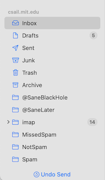
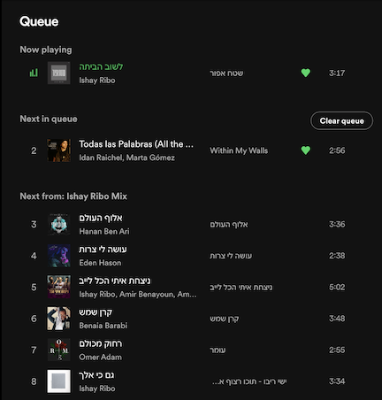

As I developed the framework of concept design, I thought that concept integrity would be central. Violations of integrity would be like feature interactions in telephony, and at the very core of software design.

I have to admit that I was wrong. Violations of concept integrity are just so egregious that they can usually not be tolerated. Consequently, they occur rarely, and other design criteria (in particular concept specificity) turn out to be more useful in practice.

When integrity violations do occur, however, they can cause major trouble for users. In EOS, I give the example of the violation of Google Drive's synchronization concept, one so painful that an angry user bought the domain googledrivesucks.com (now no longer active) to vent his frustration at losing all his files due to the design bug.

Recently, I've come across three more examples of integrity violation, causing varying degrees of surprise.

## Violation of Undo in Apple Mail

In a recent update to macOS, Apple extended the basic *Message* concept with an *undo send* action. This is handy: it gives you 30 seconds after you've sent a message to change you mind. 

Appropriately, Apple synchronized this action with the *undo* action of the general *Undo* concept. So if you send a message and then immediately execute an *undo*, it is interpreted as *undo send*, even without clicking the special transient button carrying that label.

But Apple went further. The *undo* action is synchronized with *undo send* for as long as the message has not been sent, even if another action has been performed in the meantime.

I noticed this because I have a standard way of dealing with messages in my inbox. I respond to the message, and then I either delete it, or move it to another folder. With the new *undo send*, something surprising and annoying kept happening. I would reply to a message, delete that message, and then execute undo, having decided I would prefer to file it instead. Mail would undo the send, and not the deletion.

Initially, I thought that the effect of the undo was to pop the undo-stack all the way back to the *send*. In fact, it's not that bad, and what it does instead is to keep the *send* action on the top of the stack even as other actions are performed. Either way, this violates the simple and intuitive operational principle of *Undo* that executing *undo* reverses the last action performed.

## Violation of Playlist in Spotify

The operational principle of the *Playlist* concept says that if you start playing the playlist by selecting a song and clicking play then, until you stop playing, it will play the tracks of the playlist in order from that song onwards.

Spotify aficionados will know that this isn't true. If you add a song to the queue, that song will be played before the next song in the playlist.

Arguably, there's nothing wrong with the this. The *Queue* is a nice concept that brings more flexibility to users. Moreover, the *Playlist* concept is arguably overloaded if its purposes include both organizing tracks into groups and scheduling their playing, so regarding the scheduling as a feature of only the *Queue* concept is not only a more accurate reflection of how Spotify works, but also eliminates the overloading. 

Nevertheless, the app shows signs of some design struggles here. Strangely, if the interposed song is in the current playlist, it won't be highlighted with the little playing animation that would be shown if it were next in the playlist. And the entries in the queue that show upcoming tracks from a playlist disappear en masse if you start playing a song from a different playlist. The *Queue* concept, in other words, isn't exactly a queue, and includes two distinct kinds of tracks which are treated differently: the ones added implicitly when you play a playlist and the ones added explicitly through the *add to queue* action. You might wonder: can you move songs from the explicit list to the implicit one? Yes, it seems you can. Hmmm.

## Violation of Ride in Uber

An operational principle may have caveats: that the typical outcome may not follow in extraordinary circumstances. For example, The *Order* concept promises that if you order some items, they will eventually be shipped and delivered. But customers understand that this principle cannot be a cast iron promise, and an inventory glitch may prevent its fulfillment. 

If the expected outcome fails to follow with high enough frequency, perhaps it becomes an integrity violation. 

Using Uber's ride service, I've noticed that rides are increasingly canceled. You request a ride, select the service level, confirm the pickup location and expect the driver to arrive at the prescribed time or shortly thereafter. But just before the expected arrival time, you get a message saying that the driver has canceled. (On several occasions, that message has been followed immediately by an email from Uber telling me that I have been charged a fee for canceling the ride myself.) At other times, I've received a message that the driver already arrived but couldn't find me, even though I could see that no car had passed.

The driver must surely have the ability to cancel a confirmed ride in some circumstances (such as unexpected traffic). But it seems that drivers are canceling more frequently than necessary, presumably so that they can switch to more lucrative rides.

## When integrity is lost

How do typical users respond to broken integrity? I doubt they say to themselves "ah, this app seems to be violating the essential integrity of this concept." I suspect that instead they just get confused: they don't really know what to expect when they order an Uber, what happens when they queue songs in Spotify, or what undo actually does in Apple Mail. 

For the designer, however, integrity is a yearning for what might have been: how if things had been different, everything would have been so simple…