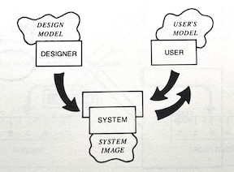

Don Norman’s influential book, *The Design of Everyday Things*, talked about doors, light switches and refrigerators, and had little to say about software. But many of Norman’s diagnoses and prescriptions applied nicely in our domain too.

We recognized, for example, that in software the gulfs of execution and evaluation—which separate the user’s intent and interpretation from the system’s actions and outputs—are especially troublesome, and we took on Norman’s notion of affordances for guiding the selection of user interface widgets.

Perhaps more significantly, we were inspired by Norman’s compelling arguments that things could be easier to use. We became groupies in the usability cult, expressing (sometimes smug, but often justified) indignation at the apparently incompetent design of most artifacts, and we vowed to do better ourselves in our software work.

Rereading the book, however, I’ve come to think that its prescriptions are in some key respects poorly matched to the design of software. In the 2013 edition of the book, twenty five years after the original was published, Norman added a new chapter on design thinking with this revealing paragraph:

*How can one person work across so many different domains? Because the fundamental principles of designing for people are the same across all domains. People are the same, and so the design principles are the same.*

But design is not just about people; it’s about technology too, and what happens at the meeting point of people and their artifacts. Different artifacts present radically different challenges. Urban design, graphic design, industrial design and software design   might all be forms of design, but they require different skills and sensibilities.

## Norman’s fridge

I’ve always been puzzled by Norman’s fridge example. In a section on conceptual models, he explains how users misunderstand the temperature controls on the standard American fridge. The two controls, often labeled “freezer” and “fresh food,” seem to offer independent temperature adjustments. But it turns out that one sets the level of the compressor and the other changes the ratio of cold air that flows to each of the compartments.

Norman rightly notes that this is design is flawed, since it’s almost impossible to make a reliable temperature adjustment. Make the freezer setting colder, and you turn up the compressor, making your fresh food colder too and freezing your salad. Try and make the fresh food colder, and you’ll divert more cold air away from the freezer, causing your ice cream to defrost. Worst of all, temperature changes in a fridge usually take a day to stabilize, so making a series of adjustments becomes a week-long exercise.

Throughout the discussion, however, Norman hints repeatedly that the problem isn’t primarily the design of the fridge’s cooling mechanism but rather the way the controls present it—what Norman calls the “system image.” Here’s his summary:

*It was extremely difficult to regulate the temperature of my old refrigerator. Why? Because the controls suggest a false conceptual model.* 

This strikes me as a very strange statement. The reason the temperature is hard to regulate is that it doesn’t provide suitable controls. It’s true that the controls suggest a false model, but if that were the problem, one could fix it by changing the labels, for example to “overall coldness” and “fridge/freezer ratio.” That’s not easy to understand, but it’s arguably no longer false. Does it help? Not at all.

## The assumption behind conceptual models
There is a fundamental assumption at play here that bears more explicit articulation. Norman is willing to take the design of the underlying mechanism largely for granted. His interest is not in reshaping mechanisms—he leaves that to engineers—but to improve the *interface*, through which the mechanism is presented to users. Here’s a diagram from the book showing how the interface projects a “system image” of the designer’s conceptual model, in turn generating the model in the user’s head:

In this respect, the original title of Norman’s book, *The Psychology of Everyday Things*, was more apt. Norman, as psychologist, is interested in how users understand (or misunderstand) mechanisms, and the valuable contribution of his book is the realization that psychological insights can be put to work in designing the interface, so that the “gulfs” between users and mechanisms are bridged.

To Norman, a conceptual model is a psychological construct distinct from any concrete reality. Designers have only so much leeway in shaping the conceptual model, because the reality is fixed, and if the model is to be accurate, it can’t stray too far from it. 

An [online lecture](https://www.youtube.com/watch?v=shSCUNxtn18) that Norman appears in makes this point abundantly clear. The canonical example it gives of a conceptual model? The rain cycle.

## Thermostats revisited
A classic example of a confused conceptual model: the traditional thermostat. Many people incorrectly believe that if the room isn’t warm enough, you should turn the dial all the way up to the top. But this won’t cause the heating system to generate more or hotter air. The setting on the thermostat simply governs the temperature at which the heating will turn off. So you’ll get warm just as quickly by setting the actual desired temperature.

Norman uses this example too, and in my view it’s a more convincing one for his argument than the fridge. Once you adopt the correct model, you can operate the thermostat more effectively. You don’t need to turn the dial all the way up and then turn it back down again when you’re happy with the temperature; you just set it once. 

There’s nothing really wrong with the underlying mechanism. It serves the user’s needs, and can be built cheaply using simple parts (typically a bimetallic strip that bends as it warms up and an attached mercury bulb that switches the heating system on and off as it tips and the mercury flows). It makes some sense, given the low cost and effectiveness of this mechanism, for the designer to take this reality as given, and focus instead on the user’s conception and operation.

But now consider a modern thermostat, such as the Google Nest. This device has a sensor that reads the temperature, but its control mechanism is defined in software. Without the need to make an affordable physical mechanism that includes both sensing and switching, the designer is freed to make it behave in any way they choose. There can be different modes and schedules; awareness of human presence; anticipated preheating periods; and so on.

These behaviors can be organized into concepts (schedule, vacation mode, zone, etc), but these concepts are not psychological abstractions. They’re not part of a model. They are the *reality* of the software design, and are just as mutable as the user interface.

## Software conceptual design

To speak of a software system or app as having a “conceptual model” is misleading. It suggests there is some model distinct from the reality of the software itself. On the contrary, the conceptual design *is* the design of the software. So I prefer instead to talk not of the software’s “conceptual model” but rather its “conceptual design.”

This is a major shift in perspective. It moves our attention away from a software system’s user interface towards its underlying semantics. It suggests that psychology, while important, might not be so central in achieving usability. And most importantly, it points to the conceptual structure of software as its essence, and challenges us to figure out what that structure should be.