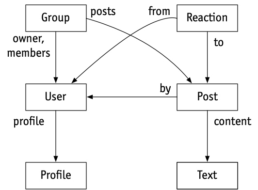
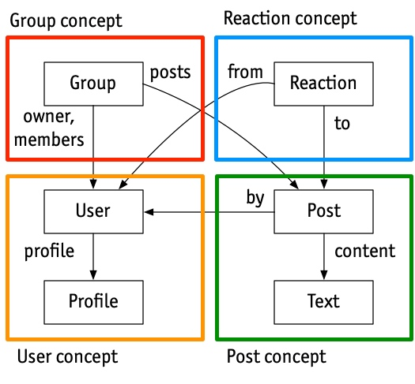
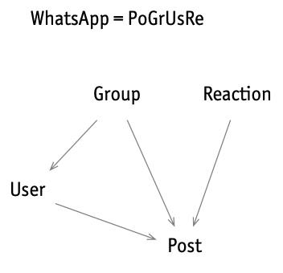

I originally wrote this post in response to a lovely invitation from Gordon Brander to contribute a [post](https://subconscious.substack.com/p/concept-design-in-three-easy-steps) to his [blog](https://subconscious.substack.com) (which I thoroughly recommend—it’s full of provocative ideas). 

# Introduction

I've spent the last ten years or so looking at hundreds of apps, trying to figure out what software design is all about. The result of my explorations is *concept design*: a new lens for thinking about software, how it’s designed, constructed and used.

Viewing software design through this lens can improve the quality of the software you build, for both developers and users, and bridge the gap between UX and engineering (which are often [siloed](https://essenceofsoftware.com/posts/ux-design-silo/) into different roles). You can think of it as a computational take on UX design. 

I call it a “new” lens, because adopting it dramatically changes the way most software design happens. But in some sense, it's not new at all. It makes explicit what I suspect the best designers have always done, and it distills and combines some ideas that have been floating around for a long time.

I’ll explain concept design in three stages, each of which suggests adopting a different perspective on design from the conventional one. 

# Stage One: Design = Functionality

Stage One is the least radical, but it’s important to grasp it before moving on: _view the design of software as the shaping of its functionality_.

This might sound obvious, but it’s not what people actually do. Functionality is what the software does, not how it does it (which is what software architecture is about), or how it’s presented (which is what UI design is about). It’s the most basic starting point, because you can’t think about code until you know what function it should implement, and you can’t think about a UI until you know what functions the UI should support. In practice, the functionality is often implicit and apps are “designed” by starting with code fragments or wireframes. Being explicit about what we’re actually [designing](https://essenceofsoftware.com/tutorials/design-general/design-vs-engineering/) is the first stage.

So imagine we’re designing a social media app—call it *WhatsUp*—that lets users post in groups. As we’re evolving the design, we’ll need a way to describe the functionality we have in mind. How do we do that?

We could start by defining the set of states: there are users, groups and posts; posts are by users and divided into groups; users can be members of multiple groups. We can explore these states more precisely by considering candidate invariants (“integrity constraints” in database lingo) as design questions: Must a post belong to exactly one group? Must a post be from a member of the group it’s in?

*The state space of WhatsUp, shown as an ER diagram*

Then we can list the actions that users can perform: *create*, *delete*, *join* and *leave* a group; *add* a post to a group; *reply* to a post; etc.

The beauty of this scheme is that just by writing down the state and invariants you’re describing a whole (infinite!) set of possible behaviors. A good designer can see through a seemingly straightforward invariant to the impacts it will have on the behavior (and even the software architecture), so the design of the state becomes a powerful design tool in its own right. Suppose we say that the posts in a group must be by members of that same group. Then what happens if a user leaves a group? Presumably their posts will have to be deleted, and that will have complicated consequences if there are replies.

The state also acts as a measure of complexity: sometimes you’ll consider some behavior and realize it needs a richer state. For example, we might want to ensure that users can only see posts in a group that were added after they joined. If so, the state will have to include not only dates for posts but also dates of joining for users.

Describing an app in terms of [states and actions](https://essenceofsoftware.com/tutorials/concept-basics/apps-are-state-machines/) is pretty challenging, and the work is often worth it. But doing it for the whole app still seems like a daunting task. Is there any way to break the task down and make it simpler?

# Stage Two: Concepts

Stage Two involves the most fundamental move, in which we bring some modular structure to an app’s functionality.

When I introduced *WhatsUp*, I described it as an app that “lets users post in groups.” You may wonder: Why isn’t that enough? You understood what I meant because you’re already familiar with the [concepts](https://essenceofsoftware.com/tutorials/concept-basics/apps-made-of-concepts/) I’m alluding to. The concept of *Group*, for example, is present in many social media apps, and goes back to the earliest chat apps (such as IRC). I could have called it *ChatRoom* instead.

What kind of “concept” is *Group*? To a philosopher, a concept is a kind of category or classification: the concept of *Dog* corresponds to the set of all things that are dogs. Applied to software, this line of thinking leads to concept lattices and ontologies. It’s useful, but I don’t believe it’s what matters most. To a software design, a concept is about behavior: a *Group* is something you join and leave and post to.

In my approach to concept design, a concept is a small service with its own API defined by its actions. I sometimes use the term “nanoservice” because a concept is like a microservice but smaller and more tightly focused. (And, as we’ll see, unlike a microservice, a concept is designed to be independent of other concepts.)

At the same time, a concept is a social protocol describing the rules of the game for the users: that you have to join the group before you can post in it, for example. All software concepts are inventions. Some of them were designed within software, and so they impose protocols on users; the *Password* concept, for example. May of them were designed first as social protocols in the world, and were then adopted by software; the *Reservation* concept, for example, (at least as applied to restaurants) was invented in the 19th century, long before OpenTable!

How to define the behavior of a concept? States and actions, just as we might have done for the app as a whole. But the difference is that now we have some structure: each concept has its own local state and actions. So the grouping of posts is part of the Group concept state, and the content of posts can be part of Post, a different concept. Joining and leaving are actions of *Group*; editing a post is an action of *Post*. Different designers (or different teams) can work on different concepts, allowing modular design of the functionality.

*The state of WhatsUp factored into concepts: each concept has its own state space.*

Now here’s where concept design diverges from current perspectives on design (such as “design thinking”). My claim is that if you look at most apps, you’ll find that they are composed of conventional concepts that appear in many other apps. That’s how we’re able to switch so easily from one social media app to another, for example.

This means that design, for the most part, isn’t about inventing a completely new set of behaviors from whole cloth. Rather, it’s about deciding which standard concepts to use, and then how to fit them together. Novelty comes from putting existing concepts together in new ways, and occasionally from introducing brand new concepts.

Apps are like molecules that have different characteristics but are built from the same atoms. So we can think of WhatsApp as the molecule *PoGrUsRe* (*Post* + *Group* + *User* + *Reaction*); Facebook as *PoFrUsUpRe* (*Post* + *Friend* + *User* + *Upvote* + *Reaction*); Twitter as *PoFoUsUpHa* (*Post* + *Follower* + *User* + *Upvote* + *Hashtag*); and so on.

_The WhatsApp molecule and its structure: the [graph](https://essenceofsoftware.com/posts/distillation/#concept-dependence-diagrams) defines a family of apps, with an arrow from concept A to concept B meaning that any (subset) app in the family that contains A will contain B too_.

How does this change the design process? It means that your first step is to figure out if some existing concepts will do the job. You might want to adjust them, or even add some new concepts. You won’t need to elaborate the states and actions of most of the concepts because you know them already.

You might wonder if this makes design less creative. I’d argue that it makes it more creative, because you spend less time reinventing the wheel and more time focusing on the aspects that are truly novel. When you put concepts together in creative ways, magical things can happen. Two examples: [Yellkey](https://yellkey.com) takes two familiar concepts—let’s call them *LinkShortener* and *ExpiringService*—and puts them together, and by ensuring that links expire quickly, can offer common words as links, completely changing the user’s experience. And the [Arc](https://arc.net) browser makes tabs more manageable by joining the *Tab* and *Bookmark* concepts in a new way.

Concept design helps you identify what makes apps distinct, and what a company’s true assets are. Photoshop succeeded because of the Layer concept; TBL’s invention of the web rests not on hypertext or markup or HTTP (none of which were novel) but on the *URL* concept; Microsoft Word introduced *Style*, the concept that almost defines desktop publishing; Dan Bricklin’s VisiCalc had *RelativeReference*, the concept that makes spreadsheets work.

# Stage Three: Independence

The full benefit of concepts comes when they can be designed (and even implemented) fully independently of one another.

Although the concepts within an app work together and interact with each other, users understand them independently. [HackerNews](https://news.ycombinator.com) combines *Post* and *Upvote* so that posts to be upvoted, and the state of the *Upvote* concept will (at runtime) contain references to posts, which are created within the *Post* concept. But in the user’s mind, the *Upvote* concept is the same one the New York Times uses for ranking *Comments*.

So we need to describe a concept like *Upvote* without any dependence on any other concept. This means first that its types can’t refer to the types of other concepts. It must be polymorphic, so that the items being voted can have any type, whether they’re posts, newspaper articles, comments, or even users.

Second, independence requires that the actions of one concept can’t call those of another. Consider Facebook’s (controversial) integration of *Upvote* and *Reaction*. We’d like to say that when a user reacts to a post, it gets upvoted too. The conventional way to do something like this would be with a function call, so that the action *Reaction.react(u, r, p)* (which means that user *u* adds reaction *r* to post *p*) is modeled as some code that call the action *Upvote.upvote(u, p)*.

But embedding a call to an action of the Upvote concept inside the Reaction concept would couple the concepts together. So what to do? The standard programming trick would be to use callbacks (or objects), but that’s complicated and takes us away from simple state and actions into the world of higher-order functions.

Concept design uses a much simpler approach, inspired by Tony Hoare’s [CSP](https://en.wikipedia.org/wiki/Communicating_sequential_processes). Instead of modifying the *Reaction* concept itself, we *synchronize* it with the Upvote concept by saying that whenever one action happens the other one should happen too:

    sync Reaction.react(u, r, p)
      Upvote.upvote (u, p)

Synchronizations are like transactions: either all the actions happen or none of them. So this sync

    sync Group.post (u, p)
      Karma.permit (u, 20)
  
might enforce the requirement that a user can post to a group only when the *permit* action of the *Karma* concept can occur (with 20 karma points).

<!---
The *permit* action is a kind of placeholder that is included in the Karma concept to allow it to be synchronized with other concepts, while its behavior (eg, permitting use 20 points only after 20 points has been accumulated) can be defined without reference to them.
--->

In many apps, especially those composed of standard concepts, much of the design challenge is figuring out how the concepts fit together. Concept design factors this out into separate synchronizations, and lets you focus on this aspect independently. Many usability problems can be traced to problematic syncs. In Google’s calendar app, for example, *Event* and *Invitation* are synchronized so that deleting an invitation sends a declining message to the inviter, which may be unwanted. (In fact, problems with this particular sync go back a long way, with users of Apple’s iCal complaining that spam events could not be deleted without notifying the spammer that the account was valid!).

And sometimes even clever syncs can’t make a concept composition work. Gmail’s composition of *Label* and *Conversation* is ingenious but troubled: you’ll understand this if you know why searching for messages with the label sent includes messages that were instead received.

Finally, in some cases, a synchronization is so powerful that it enables all kinds of new workflows. Photoshop, for example, syncs *Channel*, *Selection* and *Image* in a way that only experts fully understand but which brings amazing opportunities (you’ll know what I mean if you’ve ever extracted the edges from an image and applied sharpening just to them).

# So what can you do with all this?

As an **individual designer**, a concept design lens can change how you work:
- **App = concepts**. Viewing apps as compositions of concepts brings a new clarity: now you can explain how a word processor differs from a text editor (which has *Paragraph*, *Style* and *Format* concepts, but usually no robust *Line* concept) and from a desktop publishing app (which has a *TextFlow* concept and a real *Page* concept).
- **90% of design is reuse**. Designing an app is now mostly about combining existing concepts in creative ways. Gordon’s Noosphere takes concepts like *Notebook*, *ContentAddressableStorage*, *PublicKeyNaming*, *ImmutableDocument*, *Version*, etc and makes an entirely new platform for peer-to-peer knowledge sharing. 

- **Behavior = state + actions**. Sketching behavior as a tentative UI is very evocative, but it only goes so far. If you think about behavior as states and actions, with the help of concepts to modularize it, you can go a lot further and still avoid the complexities of code.

Concepts can help you **think more deeply** about design:

- **Synergies**. The best concept compositions bring [synergies](https://essenceofsoftware.com/posts/distillation/#concept-synergy). Making the Macintosh *Trash* a *Folder* was not inevitable, and it has some complex consequences (if you understand both concepts, you’ll be able to construct a scenario in which emptying the trash doesn’t delete the items in it).
- **Design moves**. You can think about design in steps that correspond to a repertoire of known [design moves](https://essenceofsoftware.com/posts/design-moves/), with analogies in physical design. Creating synergy by tightening the synchronization of two concepts is an example. 
- **Overloading**. Every concept should have exactly one [purpose](https://essenceofsoftware.com/posts/distillation/#concept-purposes). You can diagnose subtle flaws by analyzing concepts that are [“overloaded”](https://essenceofsoftware.com/posts/distillation/#concept-design-principles) with more than one purpose (see the knots Epson tied itself into by including tray selection in PaperSize).
- **Radical independence**. We’re used to letting all our concepts depend on each other. But what if you made them truly independent? How would file systems change if names were disentangled from identities? For one, Git would know when you renamed a file.

**At the organizational level**, concept design can have even bigger impacts:

- **Cataloging assets**. Your products’ concepts are your key assets, differentiators (and [liabilities](https://essenceofsoftware.com/posts/missing-concept/)).
- **Alignment across products**. Many companies have a family of products that drift apart over time. Aligning concepts helps users and saves dev effort.
- **Shared language**. Concepts offer a way to [bridge between engineers and designers](https://essenceofsoftware.com/posts/ux-design-silo/), and to bring your whole organization (marketing, strategy, IP) aligned on a clear understanding of your products.

And this is just the beginning. There are lots of **exciting things** to apply concepts to, such as 

- **Dark patterns**. [Deviation](https://essenceofsoftware.com/posts/facebook/) from known concepts can offer a more solid way to identify [dark patterns](https://essenceofsoftware.com/posts/dark-concepts/), and what Cory Doctorow calls the “enshittification” of apps can be explained in terms of [dark concepts](https://essenceofsoftware.com/posts/dark-concepts/). 
- **New modularization**. Concepts suggest a new way to structure code that avoids some of the entanglements of OOP.
- **Using LLMs**. We’re looking at using LLMs to help with concept design. A catalog of concepts may also help an LLM generate better code.

**Want to learn more**? My book [The Essence of Software](https://essenceofsoftware.com) explains all this and much more with hundreds of examples from popular apps. The website includes a bunch of [blog posts](https://essenceofsoftware.com/posts/), and a [talk](https://essenceofsoftware.com/posts/acm-tech-talk/). 

**Hot off the press**: a [paper](http://arxiv.org/abs/2304.14975) I wrote with colleagues at Palantir describing how they organized their development process around concepts.

There’s a concept design [forum](https://forum.essenceofsoftware.com) too, which is a great place to post reactions, questions, comments, etc. Feel free to [email](mailto:dnj@mit.edu) me too.

