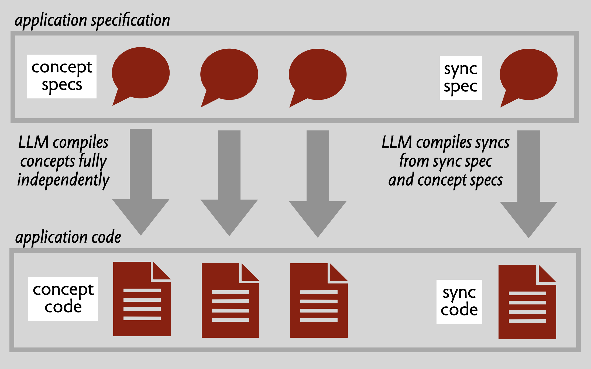

[Full paper](https://arxiv.org/abs/2508.14511)

**Dividing labor with LLMs**. As LLMs get better at writing code, it seems inevitable that there will be less work for human programmers. [Thomas Dohmke](https://ashtom.github.io/developers-reinvented) is right that low-level coding skills will matter less and that "the future belongs to developers who can model systems, anticipate edge cases, and translate ambiguity into structure—skills that AI can’t automate."

Dohmke says "We need to teach abstraction, decomposition, and specification not just as pre-coding steps, but as the new coding." As someone who has been [teaching](https://people.csail.mit.edu/dnj/publications/fall00-lectures.pdf) these things as the core of coding for a few decades now, influenced by [colleagues](https://www.researchgate.net/publication/221368374_The_CMU_Master_of_Software_Engineering_Core_Curriculum) and my own [teachers](https://mitpress.mit.edu/9780262121125/abstraction-and-specification-in-program-development/), I can't disagree with that. 

But this "division of labor" viewpoint—the human makes the big, high-level decisions and the LLM fills in the details—may not be the best way to think about AI in coding. First, it ignores the fact that LLM capabilities will undoubtedly improve, so the line between what LLMs can do and what must be left to a human coder is constantly shifting. Second, it assumes that all tasks at a particular level are alike, when in fact some high level design might be amenable to LLMs, and some low level coding may require human skills.

**Back to basics**. Instead, we might ask: how should we build software so that humans and LLMs can work more effectively together? Most observers realize that the advent of LLMs is going to produce radical changes in software development. What they may not have recognized is how, paradoxically, LLMs will force us to re-adopt classic software engineering principles that we've only paid lip service to in recent years.

**The end of software design?** When ChatGPT came out, I worried that AI would suck all the air out of the room and it'd be ages before anyone would care about software design again. But then it began to dawn on me that the success of AI will be more dependent on good software design than most people realize, and that the advent of AI is more likely to revive interest in software fundamentals. A new era for software design?

**LLM coders are amazing**. Coding has turned out to be one of the major successes of LLMs. Their capabilities are spectacular. Now that LLMs can one-shot entire applications, it's hard to remember that just a few years ago researchers were struggling to synthesize ten-line functions.

**Hype and reality**. But, as anyone who has used LLM coders knows, the reality is not as pretty as the hype would suggest. LLMs quickly hit a complexity barrier when asked to build a full application, and when they operate as programming partners in a real codebase they tend to fumble around making changes in arbitrary places, [breaking existing functionality](https://yorkspace.library.yorku.ca/items/39fdcdf5-f606-4b77-b59a-27ed480838fa), introducing [security vulnerabilities](https://www.bu.edu/peaclab/files/2024/05/saad_ullah_llm_final.pdf) and corroding the quality of the code—making coding take [more time](https://metr.org/blog/2025-07-10-early-2025-ai-experienced-os-dev-study/), not less. In short, they behave just like novice programmers.

**Today's playbook**. Most companies in this sector are following the same playbook. They hope to overcome the problems by stacking up one agent on another with more and more elaborate guidance and iterative strategies, and by giving these agents more control and wider access. It's possible that this will work, but I'm skeptical. Evidence so far suggests that granting more control merely increases the risk of [catastrophic errors](https://www.pcmag.com/news/vibe-coding-fiasco-replite-ai-agent-goes-rogue-deletes-company-database). Widening access makes it harder to localize changes (and maintain structure), and means more tokens read and higher costs to the user. It's common for agentic tools to ingest the entire codebase or reprocess a file many times even to make a [tiny change](https://forum.cursor.com/t/why-is-a-simple-edit-eating-100-000-tokens-let-s-talk-about-this/120025).

**A new approach**. A different approach is possible, however. Rather than seeking to adapt LLMs to the messy reality of software development, we might recognize that LLMs—and their failure to work effectively in complex codebases—are exposing flaws in how we develop software. They are the canary in the mine, sending us a signal that all is not happy in the way we write code.

This raises exciting prospects. If we can improve how we develop software, we might make LLMs more effective, so they scale to large and more complex systems and become more reliable even as they get better themselves. If software design can give a factor of 10 improvement for today's LLMs, we might reasonably assume it will do the same for tomorrow's, so that however effective LLMs become, good software design will continue to amplify their capabilities. And the gains improved design brings to LLMs, it should bring for human developers too.

**The key idea**. So what are the design ideas in this new approach? Well, the key idea is one of the oldest (and best). If we could structure our software in a *modular* fashion, with each module independent of the others, we could generate code one module at a time. That means the LLM's context can be just the one module, and not the whole codebase. And since important behavioral properties would be encapsulated within individual modules, those properties would, by definition, continue to hold when other modules are modified.

**Not so easy**. In practice, this is easier said than done. Codebases that purport to be modular turn out to be less modular than you might have hoped. This happens partly because modern software engineering practice encourages complex interfaces, and partly because even if programmers start out with a modular design, they're not inclined to maintain it. We've coined a term—"technical debt"—to dignify the practice of creating a mess with the naive hope of fixing it later.

**OOP to blame**. Lack of modularity happens for a more fundamental and interesting reason too. Even though most codebases for large systems are not strictly object-oriented, they tend to follow the gestalt of OOP, with functionality grouped according to the key entities of the problem domain. A typical structure for a blogging app, for example, breaks functionality into "stacks" of modules corresponding to entities such as User, Article, Comment, etc (and then breaks each stack into layers for routing, business logic and data persistence). The implicit rationale is that all functionality about users (authentication, eg) goes in the User stack; all functionality about articles (creating, deleting, editing, etc) goes in the Article stack; and so on. Unfortunately, though, a lot of functionality can't be neatly assigned to an entity. Take favoriting, for example, in which users mark some articles as favorites to make them easy to visit later. Does this functionality belong to the User stack or the Article stack? There's no good answer to this, and in one codebase we looked at it was split across both!

**A concept-based approach**. [Concept design](https://essenceofsoftware.com/posts/three-stages/) makes modularity much easier to achieve. Concepts are defined not by entities but by user-facing purposes. So different functions associated with users (authentication, naming, profiles, notifications, preferences, etc) would be factored into distinct concepts. And favoriting would have a natural place—in its own concept.

**Concepts are independent**. Concepts are, by definition, *completely* [independent](https://essenceofsoftware.com/tutorials/concept-basics/modularity/) of one another. They have no knowledge of the interfaces (let alone the internals) of other concepts. All references to shared objects are fully polymorphic, and mutable state is never shared across concepts. This means that each concept can be designed and implemented by itself. 

**Synchronizations for composition**. So if concepts are independent, how are they coordinated at runtime? That's what synchronizations (or syncs) are for. A sync is a kind of mediator that ties together actions across concepts, and manages dataflow between them. Syncs are very granular, and they factor out application-specific behavioral details that might otherwise compromise the reusability of concepts. For example, in our blogging example, syncs might include interactions such as:
- Only allow an article to be editing if the authenticated user is the author
- When an article is deleted, delete its comments too
- When a comment is deleted, notify the author of the comment
Syncs *do* need to know about concepts, but they only need their specifications.

**What we've done**. We started experimenting with this idea two years ago. [Barish Namazov](https://barish.me), at the time an undergraduate in my research group, built a prototype tool called Kodless that generated concept implementations from minimal concept specification prompts (short talk [here](https://www.youtube.com/watch?v=WgOhtH3lugk&list=PLY_nsiUEgM3nbxcO3_ONmKL-ZRhLKpfGV)). (In Kodless, syncs were implemented as routes (HTTP endpoints), so they weren't so granular.) Barish demonstrated that this worked by generating a backend for a HackerNews clone.

Over the last year, my PhD student Eagon Meng has been working on improving this scheme. He developed a patterns for expressing granular syncs, and implemented it first using SPARQL and a graph database, and them more recently as a lightweight Typescript library. He also define a simple concept specification language. To demonstrate this new approach, we applied it to [RealWorld](http://realworld.io), a benchmark collection of implementations of a Medium-like blogging app called Conduit. Standard LLMs have little trouble generating the concept specs from minimal prompts, and then generating concept implementations from them. Syncs are a bit trickier and needed some iteration, but LLMs seem to have no trouble with this pattern despite it being a bit unconventional.

**WYSIWID**. The key quality of this approach is that code becomes "legible", with a more straightforward correspondence between the behaviors that the user cares about the modular structure of the code. Concepts are a new kind of module which, unlike traditional modules, are **user-facing** (always having a purpose that maps directly to some user needs), **fully decoupled** from one another, and that **separate concerns** more cleanly. Syncs allow application-specific details to be factored out and represented in a granular way. In short, **what you see** (in the code) **is what it does** (for the user). Together, concepts and syncs offer a new structural pattern that allows LLMs to be applied in a more incremental and focused way, reducing costs while increasing scalability and integrity. 

**Progress so far**. We've written a [paper](https://arxiv.org/abs/2508.14511) explaining all of this which will appear at [SPLASH Onward!](https://2025.splashcon.org/track/splash-2025-Onward-papers) this fall. We're teaching this approach to undergraduates in the Software Design [class](http://61040-fa25.github.io) that I'm running with my colleague [Mitchell Gordon](https://mgordon.me) at MIT this fall. We've been using concept design and implementation in the class for several years, so what's new is not the structure and modularity but leveraging LLMs to generate code. As a dry run, we did a hackathon with the wonderful folks from the [Sundai Club](https://www.sundai.club) a few weeks ago. About 40 people came and they spent the day using a concept-infused version of Cursor to generate some really impressive little apps.

**Prospects**. We're excited to see where this goes. One direction, in the spirit of low-code apps, would be a SAAS tool for non-experts that offers a library of reusable concepts, and synthesizes apps by selecting concepts and compiling application-specific syncs to glue them together. Another, aimed at developers, would be an agentic workflow that not only compiles concept specs but also helps write them. We're also thinking hard about front ends, and how they might also be structured with concepts and syncs, eliminating the aggregation of cross-concept data that currently makes endpoints needlessly complicated. Whatever happens, it seems that software design is here to stay...
