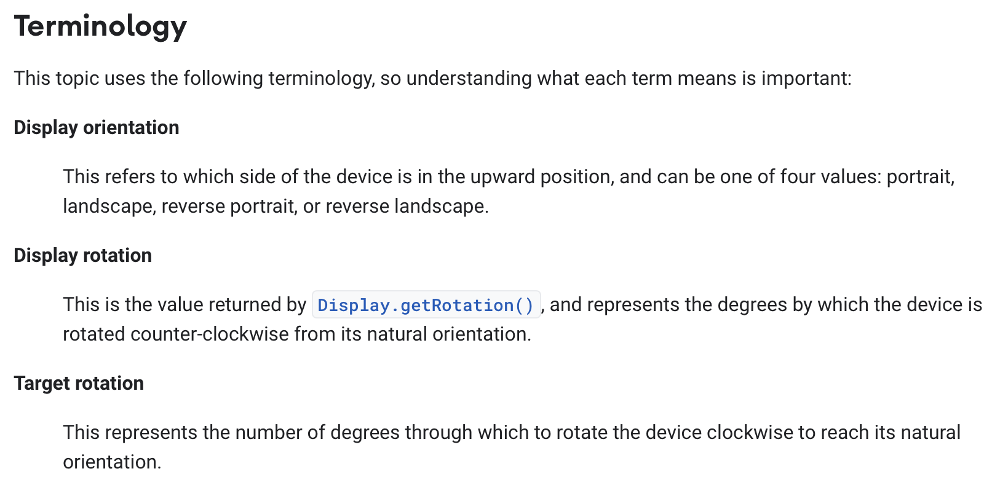
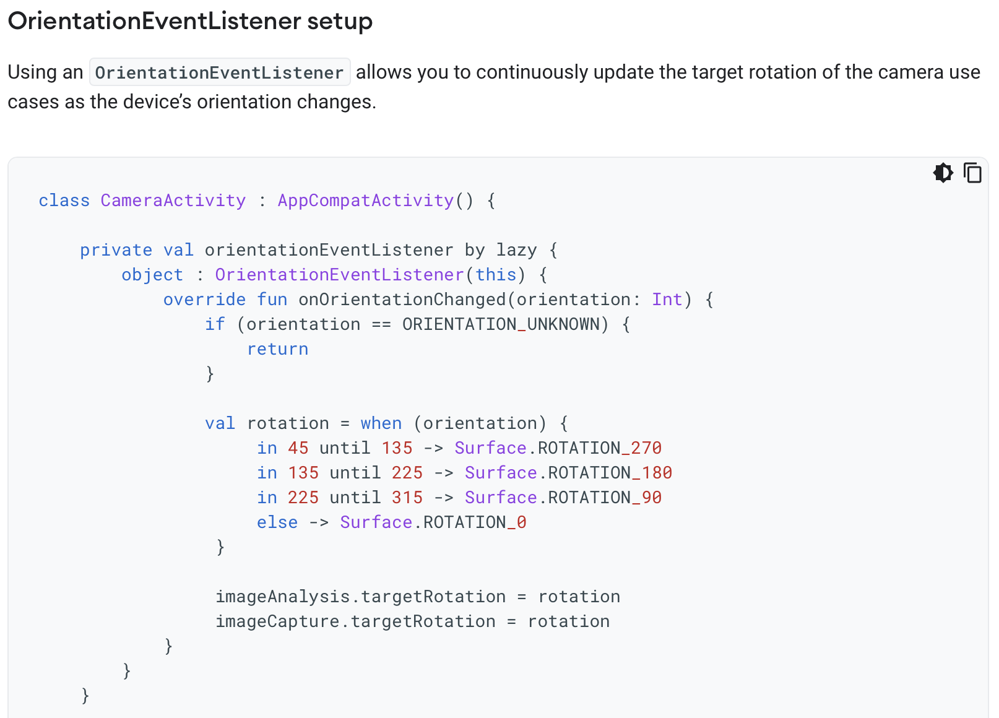
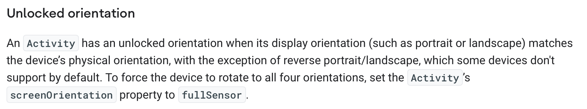
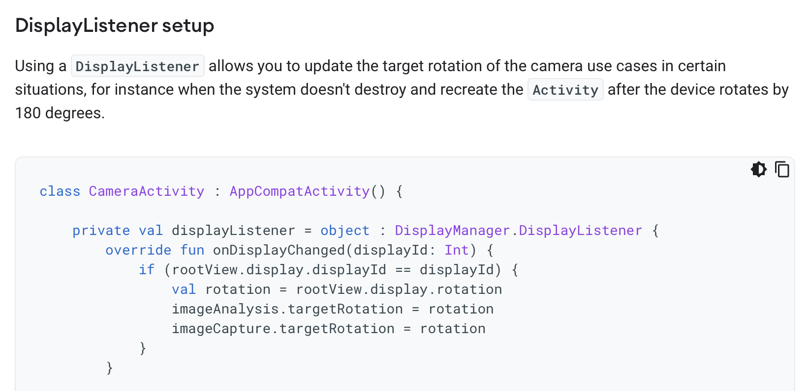
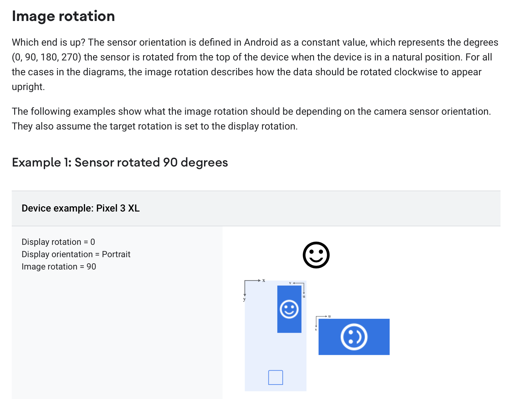

## API Design at Google

Concept design was developed for shaping the functionality of apps, and  because it emphasizes the underlying semantics behind the user interface, it should be straightforward to apply it to the design of services. But can it be applied to APIs?

Recently, inspired by discussions with Meital Tagor Sbero, a UX research manager at Google, I’ve started looking into whether it might be useful in the design of APIs. 

Meital runs a team working on making APIs easier for programmers to use. They have been applying [cognitive dimensions of notations](https://en.wikipedia.org/wiki/Cognitive_dimensions_of_notations), a  collection of heuristic principles for  usability (due to Thomas Green and Marian Petre) to the design of Android APIs. 

One of the heuristics is called *closeness of mapping* and suggests that  a notation (or in this case an API) should correspond closely to the problem world. Concept design seems to offer a way to pursue this goal.

As an example of an API that programmers find hard to understand, Meital pointed me to the [Android Camera API](https://developer.android.com/training/camerax). I decided to focus for a small case study on the [Rotation API](https://developer.android.com/training/camerax/orientation-rotation), because it’s small and seems to have some complexities that concepts can address. I’ve developed a concept model of this API which I believe resolves some of the problems in understanding it, but the model is not complete and it may well contain errors that reflect my own misunderstandings. I’ve also not done the hard work of mapping the concept actions and states to the programmatic components of the API.

## Why the Rotation API is tricky

Before showing you the concepts I came up with, I need to explain why the Rotation API isn’t so easy to understand. I’ll do this by pointing to explanations within the official API documentation.

The documentation starts by introducing some key terms:

Reading this, I found myself confused:

- **Target = display?** If the display rotation “represents the degrees by which the device is rotated counter-clockwise from its natural orientation” and the target rotation “represents the number of degrees through which to rotate the device clockwise to reach its natural orientation”, why aren’t the two always equal? And indeed, in the graphical examples that follow, the two are equal.

- **How many orientations?** The display orientation is said to have only four values, but the phone can surely be held in between these. Indeed, the code sample that appears later shows an *onOrientationChanged* listener that gives an orientation in degrees:

- **Display or device?** The definitions seem to use the terms “display” and “device” interchangeably, but later it will transpire that the display orientation may not match the device orientation:

Furthermore, a second code sample shows an alternative way to set the target rotation not using the *onOrientationChanged* listener but using the *onDisplayChanged* listener instead:

The next section introduces two new terms: *sensor orientation*, “a constant value, which represents the degrees (0, 90, 180, 270) the sensor is rotated from the top of the device when the device is in a natural position” and the *image rotation* which “describes how the data should be rotated clockwise to appear upright.” A series of diagrams then illustrate sensor orientations for different phones:

This puzzled me. How can the sensor be rotated and not be aligned with the phone? If the Pixel 3XL indeed has a sensor that is rotated 90 degrees, that would mean that the sensor would be in landscape mode when the phone is held upright in portrait mode.

## A Conceptual Take

Here is my attempt to resolve these issues and explain what I believe is going on here.

First, the phone contains an accelerometer that gives its rotation from the upright position. I’ll model this in a simple concept with just one state component (holding the current rotation) and an action that is called whenever the rotation changes:

	concept DeviceRotation
	purpose provide physical rotation info from accelerometer
	principle
	  when user rotates device R degrees
	  counterclockwise from upright position, rotationUpdated(R) occurs
	state
  rotation: Degrees
	actions
	  // system action performed whenever
	  // change in rotation is detected
	  // outputs current rotation and sets rotation = r
	  rotationUpdated (out r: Degrees)

I’m using the word “rotation” throughout for an angular measurement, and reserving the word “orientation” for portrait, landscape, etc. But note that this *rotationUpdated* action is the *onOrientationChanged* listener in the API.

Note that the notion of physical rotation is non-trivial, and isn’t even defined when the phone is parallel to the ground: you’ll have noticed this when you’ve taken photos of something on the ground and been surprised that the resulting image’s orientation seems wrong. But the notion should be intuitively clear enough that we can proceed to the other concepts.

Our second concept models just one aspect of a digital camera, namely how a captured image has a rotation associated with it:

	concept Camera
	purpose take images with recorded rotations
	principle
	  after setAdditionalRotation (r); capture (i)
	    {i.rotation = r + defaultRotation}
	state
	  const defaultRotation: Degrees // defined by hardware
	  additionalRotation: Degrees
	  rotation: Image -> Degrees
	  rows: Image -> seq seq Pixel
	actions
	  setAdditionalRotation (r: Degrees)	  
	  // make new image i with i.rotation = defaultRotation + additionalRotation
	  capture (out i: Image)

Images are represented here naively as rows of pixels. Each image has a rotation associated with it. This rotation is intended to be applied to the image when it is displayed, and is chosen so that the image will have the appropriate orientation.

For example, if the camera is positioned to take an image in portrait orientation, but the first row in the recorded image corresponds to the pixels in the rightmost column as seen through the camera viewfinder, the image will need to be rotated by 90 degrees (clockwise) to be displayed correctly.

This scenario might still occur if the portrait orientation is the natural orientation of the camera (as it is for most mobile phones), because it’s not necessary to require the sensor always record an image so that rows are horizontal in the natural orientation. 

This is why there is a hardware-specific *defaultRotation* that holds the rotation that must be applied when the camera is in its natural orientation. So for a camera that has a natural portrait orientation, but whose sensor records rows as just described, the *defaultRotation* will be 90, and that will determine the image *rotation*. Now if the camera is held in landscape orientation (by being rotated 90 degrees counterclockwise), the *additionalRotation* will be set to -90 degrees. As a result, the *rotation* of the image will be the sum of these, and will be zero, reflecting the fact that in this position the sensor happens to record the image in the expected orientation.

The *defaultRotation* is what was called “sensor rotation” in the API documentation, and the *rotation* associated with the captured image is the “image rotation”.

Now finally the most subtle concept. As the user rotates the camera, we need to infer from the extent of the rotation whether the intended orientation is portrait or landscape. Clearly when the camera is perfectly upright, a portrait orientation is intended; and when it is perfectly on its side, rotated 90 degrees counterclockwise, a landscape orientation is intended.

But what about in between? Here’s what you might see as you rotate a camera from portrait through to landscape:

Near the extremes, the intended orientation is clear, but in the middle (as illustrated by the example shown on the bottom right) it seems arbitrary. Perhaps the intended orientation could be inferred by looking at the sensor image, but the angle of rotation alone won’t answer the question definitively.

To model this, we define a concept that infers an orientation from a given angle:

	concept UserOrientation
	purpose
	  infer intended camera orientation from device angle
	principle
	  (1) after updateDeviceAngle (a); getInferredOrientation (o, d)
	    {o is the inferred orientation and d its value in degrees}
	  (2) after toggleLock(); updateDeviceAngle (a); getInferredOrientation (o, d)
	    {o is PORTRAIT and d is 0}
	state
	  Orientation = {PORTRAIT, LANDSCAPE, PORTRAIT_REV, LANDSCAPE_REV}
	  inferredOrientation: Orientation
	  deviceAngle: Degrees
	  orientationLock: Bool = false
	action
	  toggleLock ()
	  updateDeviceAngle (angle: Degrees)
	  getInferredOrientation (out orientation: Orientation, inDegrees: Degrees)

The concept holds in its state:
- the inferred orientation of the device, which has one of four values (including the “reverse” versions of portrait and landscape, namely when the camera is upside down);
- the angle at which the device is being held;
- and an orientation lock field, which when true holds the inferred orientation to be the standard portrait orientation.

There are three actions:
- *toggleLock* simply toggles the orientation lock;
- *updateDeviceAngle* updates the angle;
- *getInferredOrientation* returns as outputs the inferred orientation, and its equivalent in degrees.

This last action embodies whatever (arbitrary) decision we make on when to switch between orientations.

## Synchronizing the concepts

Now we can put the concepts together:

	app Camera
	include
	  concept DeviceRotation
	  concept Camera
	  concept UserOrientation

and connect their behaviors with synchronization. The essential one occurs when a device rotation is detected:

	sync updateRotation (out r, o: 0..359)
	  when DeviceRotation.rotationUpdated (r)
	    UserOrientation.updateDeviceAngle (r)
	    UserOrientation.getInferredOrientation (_, o)
	    Camera.setAdditionalRotation (o)

When the accelerometer reports a change in the rotation of the device, a new inferred orientation is obtained from the new angle, and the additional rotation in the camera is updated accordingly.

## Connecting back to the API

Now looking back at the API code sample we can understand it more readily:

The firing of the *onOrientationChanged* listener corresponds to the *DeviceRotation.rotationUpdated* action that fires the sync; the *when* statement that assigns rotation based on orientation is an implementation of the *UserOrientation.getInferredOrientation* action; and the setting of *imageCapture.targetRotation* is the *Camera.setAdditionalRotation* action.

In the alternative code sample, 

my guess is that the following is going on. There is a separate and fuller implementation of the *UserOrientation* concept that rotates the display for apps in general (and is appropriately sync’d with the other concepts as above). The camera can use the  orientation reported directly by this module, obtaining the *rotation* field of the *display* object. This presumably is affected by whether the orientation lock is on, and perhaps also by whether the app in question is using this feature. 

## Summary

In summary, we’ve resolved our initial questions as follows:
- The word “orientation” seems to be used in two distinct ways: for the device rotation, and for the inferred orientation.
- The “sensor rotation” is just the default rotation associated with captured images, and the “image rotation” is their total associated rotation.
- Because the phone already includes a module that infers orientation and rotates the *display* accordingly, display orientation and device orientation are distinct, and a programmer might be able to obtain the display orientation directly, bypassing the need to make the inference in application code.

What are the benefits of the conceptual view here? I’d argue that they are:
- A clean **separation of concerns**, into (a) obtaining the device rotation from the accelerometer; (b) storing rotations with images; and (c) inferring orientations from rotations.
- A **purpose** and simple **scenarios** (OPs) for the concepts, in particular the *UserOrientation* concept which the API docs didn’t make clear is heuristic.

It remains to be seen how this kind of concept design can best be worked into API documentation. It’s clearly not ideal to have a textual notation for concepts that is different from the typical interface specs of APIs. One possibility is to represent concepts diagrammatically.

Another challenge involves mapping the concepts to the sometimes complex object-oriented patterns that are used in APIs, which are often more like frameworks (with application code written as subclassing extensions) than service interfaces.