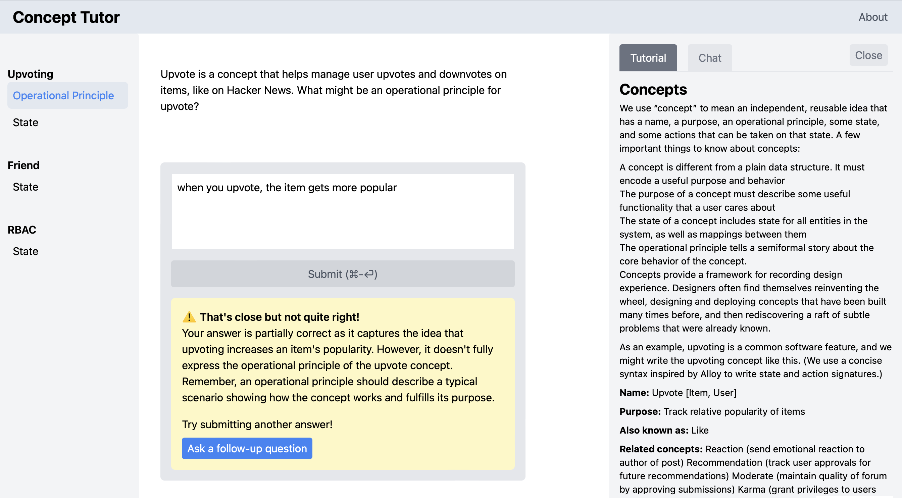
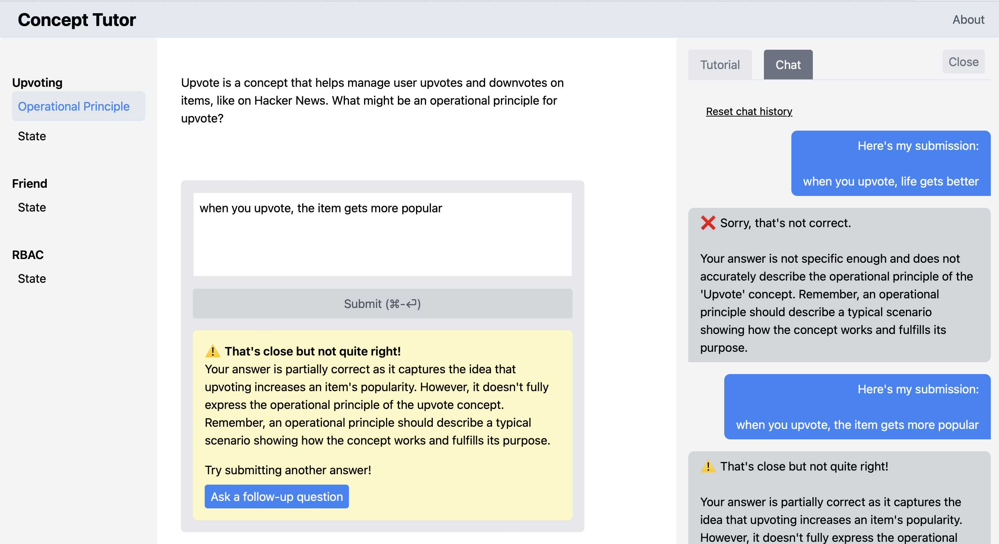
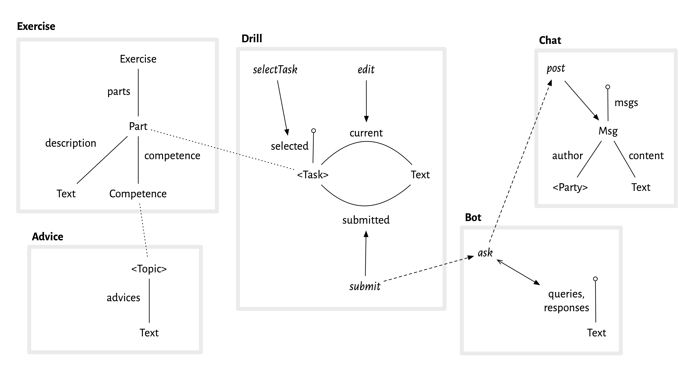

## Overview

**About this case study**. This case study presents a concept design for a GPT-powered tutor that we built in May 2023 for experimental use in the MIT class [6.1040: Software Studio](https://61040-fa23.github.io) this coming fall. Geoffrey Litt had the idea for the tutor and implemented it; the concept design was a joint effort. In [this video](https://share.cleanshot.com/P0VybXyY) Geoffrey demonstrates the tutor in action.

**Primary motivations**. From a concept design perspective, the case study offered an opportunity to:
- Apply concept design in the earliest stages of development of an app;
- Provide an example of concept design for a real but  small problem;
- Illustrate how concepts can help you address the kinds of design challenges that arise even in simple apps.

**Modular implementation**. Geoffrey used this case study also as a chance to explore the use of concepts as a modularity mechanism in the code. He implemented the tutor in his [Riffle](riffle.systems) framework, and used the concept design to guide the structure of the relational tables and code, so that each Riffle component corresponds to a concept. The results seem to be promising, bringing more clarity and modularity than a traditional design might have produced. I hope that Geoffrey will write something about this at some point.

## Design Goals and Principles

**Goals**. The goals of building and deploying the tutor are:

- To get some initial experience using GPT-like tools in education;
- To help students learn concept design;
- To gather data both about students’ learning of concept design and about the performance of the AI tutor;
- To refine the pedagogy around concept design.

**Pedagogical alignment**. Exploiting LLMs in teaching depends not surprisingly on providing good prompts. One of the most exciting aspects of this project has been the realization that the kinds of prompt GPT seems to need correspond closely to (my perceived sense of) what students need, namely short and explicit tutorials that offer actionable advice and concrete examples, both positive and negative. Due to the limitations of window size, we are also encouraged to make our tutorials as granular as possible, so that the prompts for a particular task can be limited to only the advice that is essential for that task. A further pedagogical alignment arises in the need to explicitly identify competences, linking the tasks students are asked to fulfill to the understanding those tasks require (and thus to the advice that will help them develop such understanding).

**Design principles**. In embarking on this project, we adopted a few principles to guide it:
- To make the Simplest Thing That Works (STTW), as agilistas would say: that is, focusing on the smallest set of concepts and behaviors that would meet the goal of supporting students effectively;
- While serving the needs of concept design, to make the tutor as general as possible, avoiding any needless specialization, so that it might be applied in other domains;
- To reduce barrier to usage by students, which suggested not requiring accounts (and keeping interactions anonymous), implementing as a cross-platform web app (without browser extensions), and not being prescriptive about the order in which students attempt exercises;
- Making maintenance and deployment easy for course staff, and ensuring that adding new questions and advice was straightforward, which suggested making a serverless app (the implementation requiring only a tiny lambda function to proxy API requests to GPT) and not implementing a web-based UI for staff, but instead taking questions and advice from a table-structured file that is easily edited.

**Choice of tech stack**. Initially, one of our principles was to implement the tutor using the tech stack taught in the class (Node/Express/Vue) so that the implementation might serve as a pedagogical example for students, but we decided in the end to use [Riffle](riffle.systems) instead, both to "eat our own dog food", exercising our research on that platform, and taking advantage of Riffle’s benefits, both in ease of development and to the user (most notably the full history of the user's interactions being persisted locally in a SQL database inside the browser, giving the appearance of a backend storage without the need to implement it or compromise the user's privacy).

## Initial design

**Basic conception**. We started with the simple idea that the student would be presented with a collection of structured exercises. Attempted solutions to the exercises would be graded by GPT, providing feedback to the student, and allowing repeated submissions until the student was able to submit a solution for which GPT reported no evident flaws.

**Prompt contents**. We assumed that we would not fine-tune the LLM, but would use GPT out of the box with appropriate prompts. We planned to include in the GPT prompt for a particular exercise the following elements:
- The text of the exercise itself;
- A general prompt instructing GPT to behave as a tutor and to provide constructive advice without revealing the answer to the student, and to return its response as a JSON structure with a simple numeric grade (corresponding to poor, ok and good) and feedback text;
- One or more tutorials relevant to the competence being tested;
- A few sample graded solutions to the particular exercise (containing both grades and feedback).

**First concepts**. Our initial brainstorm identified the following concepts:
- **Exercise**: a concept defining the structure of exercises and the pattern of behavior of a student in submitting solutions.
- **Advice**: a collection of pieces of advice, each being a text string, perhaps indexed in competencies. We anticipated using this advice both as prompts for the LLM and as part of a help facility for students.
- **Bot**: we assumed we'd need a concept to represent the pattern of interactions with the GPT service. The need for such a concept became less clear as the design progressed, since GPT's API (unlike its browser interface) is not stateful, and treats each query independently, so that the behavior is little more than a series of queries that produce responses.
- **Editor**: initially, I assumed we'd want a concept to embody the text editor that the student uses to edit and submit candidate solutions to exercises. 

Here’s a screenshot of the running app, showing the exercises on the left (with the selected exercise part highlighted); the submission and feedback boxes the middle; and the advice and chat panels on the right (explained in more detail below):

## Design Challenges

We pursued the design of these concepts in the light of several key challenges that we identified.

**Saving student solutions**. We intended to include a simple way for students solutions to be saved, both so that students themselves could review their work and so that we could evaluate which exercises were the most useful, what students were able or not able to do, and so on. 

Initially, we thought to include this functionality in the *Exercise* concept. This would result in a nice operational principle (OP) for the concept, with the student selecting an exercise and submitting a series of solutions. If this functionality were instead factored out into another concept, the *Exercise* concept would be little more than a data structure containing the exercises, and would lack a compelling OP.

On the other hand, we realized that the submitted solutions would need to be indexed on the identities of students. In concept design terms, this means that the state of the *Exercise* concept would include relations like

	submitted: Student -> Solution

And yet there is no interaction between students; each student's behavior and subsequent submitted solutions are independent. This suggests what I call *lifting* the concept, and defining the application using an indexed collection of concepts rather than indexing within the concept state itself. So the application might be declared like this

	include
		User
		UserExercise: User.User -> one Exercise

so that it includes a *User* concept (which exports a type *User.User* corresponding to the set of users), and an indexed collection *UserExercise* of concepts, with *UserExercise[u]* being the exercise concept for user *u*.

This is bad because it inappropriately replicates not only the student-specific submission behavior but also the exercises themselves, which should be defined independently of any students.

This dilemma is easily resolved by factoring out the part of the concept that is indeed student specific. So we created a new concept, which we called *Drill*, to represent the student behavior; this concept can now be indexed, and the *Exercise* concept can remain a single, student-independent concept instance. As we'll see when we elaborate *Drill*, the concept will also include the current state of the student's attempted solutions, obviating the need for an *Editor* concept.

We have yet to implement solution submission, and the app runs independently within each student's browser. So we might have maintained a single *Exercise* concept that is student-independent because there is only one student in scope (namely the one using this browser). But the separation into *Exercise* and *Drill* is straightforward and brings some clarity without much overhead, and it ensures that our app is ready for this likely extension.

The one downside of this approach is that the *Exercise* concept no longer has a compelling OP; all the interaction happens in *Drill*. This seemed a reasonable price to pay, and made me realize that I should acknowledge a class of “CRUD concepts” that are essentially just containers for data. I’ve been resisting this idea but it seems that most applications are likely to have one or more of such concepts.

**Linking advice to exercises**. How should advice be linked to exercises? Our initial idea was to include, in the *Exercise* concept, a mapping from parts of exercises to the “competences” that they tested, and to index advice texts in the *Advice* concept on “topics” that would be equated to competences. The two concepts would be polymorphic in these types, with an additional *Competence* concept providing concrete competences to instantiate the two other concepts:

	include
		Competence
		Advice <Competence.Competence>
		Exercise <Competence.Competence>

Note that I’ve overloaded *Competence* here so it refers to both the concept and the type of value it exports (as I did for *User.User* above).

This approach makes sense, but there wasn’t much functionality we wanted to associate with competences aside from the linking of exercises to advise. So we decided to simple have the *Exercise* concept define (and export) the competences. This gives the following structure

	include
		Exercise
		CompetenceAdvice: Advice <Exercise.Competence>
		ExerciseAdvice: Advice <Exercise.Part>

in which *Advice* is instantiated with the *Competence* type provided by *Exercise*. Note that I’ve instantiated *Advice* twice: once for the advice associated with competences, and a second time for the advice associated with individual parts of exercises.

**Maintaining editor state**. Our sketched UI included a text box in which the student enters attempted solutions. We wanted to persist the content of this box across submissions, so that when a student gets feedback and wants to adjust their last submission to create the new one, they don’t need to cut and paste the prior submission in (or, worse, have to retype it). We also thought it would be good to allow a student to switch between unfinished exercises, so that when you return to an exercise you can continue editing the solution.

This functionality was easily accomplished within the *Drill* concept, with state components for (a) the task that is selected; (b) the current text associated with each task; and (c) the submitted text for each task.

	concept Drill <Task>
	state
		selected: lone Task
		current: Task -> lone Text
		submitted: Task -> lone Text

Since the *Drill* concept should work with text being submitted for any kind of task, a type variable *Task* is used to represent what will be, when instantiated, the exercises (or actually their parts).

These state components are updated by actions in the obvious way: editing the text in the text box corresponds to an *edit* action that replaces the *currentText* associated with the *selected* task; submitting a solution corresponds to a *submit* action that copies the *current* text of the *selected* task to the *submitted* text of that task.

By virtue of this state and actions, this concept eliminates the need for a separate *Editor* concept.

**Integrating chat**. We implemented the design as described above, and also included a help panel with two tabs. One shows advice associated with the current exercise part, produced by a query that looks in the state of the *Advice* concept for the advice associated with the selected task in the *Drill* concept. The other offers a chat interaction with GPT, where the user can ask follow-up questions. 

Two questions arose for the chat interaction. First, what would be the context for the chat? It seemed clear that there should be a separate chat thread for each exercise part, switched using the same action that switches the (solution editing) text box. The prompts for this chat would then be (a) the same advice provided for the grading, along with (b) prior submissions, and (c) earlier questions asked by the student in that thread.

It wasn’t obvious at first how to integrate the prior submissions and grading feedback into the chat thread. One possibility was for the chat per se to show only chat questions asked by the student and the responses to them, with the submitted solutions and their feedback shown in a different way--either in a thread in a separate panel, or shown inserted into the chat thread as special objects.

A moment’s reflection made it clear that this kind of solution was baroque and needlessly complicated. It would either require yet another UI panel (and make it harder for the user to see which follow-up questions followed which submissions) or it would make the chat thread UI non-uniform. The solution is simply to fully embrace the familiar *Chat* concept, in which a thread comprises a sequence of messages from two (or more) parties. Then student submissions and feedback are then just injected as regular messages, from the student and bot respectively. It might also have been possible to treat these messages as originating with two additional users, distinguishing the two roles of the student (as submitter of solutions and asker of follow-up questions) and the two roles of the bot (as grader and question-answerer). Rather than doing this, we chose to stick to two parties in the chat and to prefix the submissions and feedback with “You submitted: ...” and “Feedback: ...”.

Here’s a screenshot showing the chat panel:

## Final Concept Design

We now outline the concepts in detail. The *Exercise* concept manages the exercise texts, and associates parts of exercises with competences:

	concept Exercise
	purpose construct and present structured exercises
	principle // just a CRUD concept
	state
	  parts: Exercise one -> set Part
	  competence: Part -> one Competence
	  description: Exercise + Part -> one Text

(Since the purpose of the concept is just to store exercises, it doesn’t have an interesting operational principle, so rather than elaborating the expected behavior of CRUD actions, I’ve just omitted them and left the principle empty too.)

The *Advice* concept indexes advice texts on generic topic identifiers (which will later be instantiated with competences and exercise parts):

	concept Advice [Topic]
	purpose manage indexed repository of advice
	principle // just a CRUD concept
	state
	  advices: Topic -> set Text
	  name: Topic lone -> one Text

The student activity of completing an exercise is handled by the *Drill* concept:

	concept Drill <Task>
	purpose
	  store incremental student work on set of tasks
	principle
	  // if you select a task, edit a solution
	  // and submit it, the final edit is recorded
	  // as the submission
	  selectTask (t); edit (x1); edit (x2); submit ();
	  {t.submitted = x2}
	state
	  selected: lone Task
	  current: Task -> lone Text
	  submitted: Task -> lone Text
	actions
	  selectTask (t: Task)
	    selected := t
	  edit (x: Text)
	    selected.current := x
	  submit ()
	    selected.submitted := selected.current

The *Task* type is left generic, but will be instantiated later as the *Part* type of the *Exercise* concept.

The *Chat* concept will manage the informal exchanges between user and bot, and will have the exercise submissions and their grading injected as additional messages:

	concept Chat <Party>
	purpose multi-party exchange of messages
	principle
		// series of posts gives expected msg sequence
		post (p1, t1, m1); post (p2, t2, m2);
		{msgs = <m1, m2>, m_i.author = p_i, m_i.content = t_i, etc}
	state
	  msgs: seq Msg
	  author: Msg -> one Party
	  content: Msg -> one Text
	actions
	  post (p: Party, t: Text, out m: Msg)

Finally, the concept that captures the protocol of interacting with LLMs like GPT:

	concept Bot
	purpose handle interaction with AI agent
	principle
	  // a query is submitted and a response is given
	  ask (q1, r1) {queries = <q1> and responses = <r1>}
	state
	  queries, responses: seq Text
	actions
	  ask (query: Text, out response: Text)

This is almost the simplest form this concept might take, with the prompts included in the question text. A richer concept would allow prompts to be registered upfront. The API version of GPT is actually stateless, so even the question and answer sequences are not strictly necessary.

## Concept Composition

The app as a whole is a composition of concepts:

	app ConceptTutor
	include
	  User
	  Exercise
	  UserDrill: User.User -> one Drill <Exercise.Part>
	  CompetenceAdvice: Advice <Exercise.Competence>
	  ExerciseAdvice: Advice <Exercise.Part>
	  UserPartChat: User.User, Exercise.Part -> one Chat <BOT + USER>
	  Bot

We haven’t specified the *User* concept, since it could take many forms; all that matters for tracking completed exercises is that it provide some identifiers, given by the type *User.User*, which indexes the *Drill* concept, so there is one instance of *Drill* for each user. In our implementation, the browser naturally provides a distinct identifier for each user and no explicit implementation of such a concept is needed. We currently aren’t recording completed exercises, but could easily do that by labeling them with a browser identifier, for example.

There are two instantiations of the *Advice* concept, one holding advice for each competence and one holding specific advice for each exercise part.

The *Chat* concept is instantiated in two dimensions, over users and exercise parts, so each user has a separate chat for each exercise part they are working on. The *Party* parameter of the *Chat* concept is instantiated with a type consisting of two simple constant values: *USER* representing the user, and *BOT* representing the LLM bot. Don’t be confused by the *User* vs. *Party* types: the users of the app as a whole are not the parties to the chats, since each chat involves only one user (and the bot).

## Concept Synchronizations

Almost all of the actions of the concepts are executed independently but there are a few key synchronizations.

One occurs when the student submits a solution to an exercise part:

	sync userSubmitsPart (u: User)	
	  when UserDrill[u].submit ()
	  let
		  p = UserDrill[u].selectedTask
		  c = Exercise.competence[p]
		  q =
		    ExerciseAdvice[p]
		    ^ CompetenceAdvice[c]
		    ^ Exercise.description[p]
		    ^ UserDrill[u].current[p]
	  in
	    Bot.ask (q, r)
	    UserPartChat[u,p].post (USER, q, qm)
	    UserPartChat[u,p].post (BOT, r, rm)

When a user clicks on the button to submit a solution, the relevant exercise part *p* is the one that is selected (in the *Exercise* concept), and it has an associated competence *c*. The advice texts for the exercise and competence are found in the *Advice* concept state, and concatenated with the exercise text and the student solution to form the query *q* to the LLM. The query and the LLM’s response *r* are then posted in the chat on behalf of the nominal *USER* party and *BOT* party.

**A technical note**: For brevity, I’ve assumed that the *out* parameters of actions are declared implicitly. In a more conventional programming style, I might have written

	Msg rm = UserPartChat[u,p].post (BOT, r)

for example. I prefer to treat the out parameters more like other arguments so they can be named (which matters more when an action has more than one of them). Also, I haven’t included the extra prefixes that are added to the chat posts (“You submitted: “, “Feedback: “).

A similar but simpler sync is needed when the user posts a question to the LLM in the chat.

## The design as a diagram

The entire concept design can be shown as a diagram. Here it is:

Each concept is shown as a box with a thick grey outline. Inside each box, there is the concept state (shown as a kind of entity relationship diagram), and arrows representing actions.

Let’s look at the *Drill* concept, for example. There are two sets represented in the state by the capitalized words \<*Task*\> and *Text*. \<*Task*\> is a type parameter (hence the angle brackets); you can see from the dotted line that in the composition it is bound to the *Part* type of the *Exercise* concept. *Text* is a primitive type of text strings. The two relations between \<*Task*\> and *Text* are shown as solid lines, and correspond to the declarations in the textual form of the concept:

	  current: Task -> lone Text
	  submitted: Task -> lone Text

The “pin” labeled *selected* represents the selected task:

		selected: lone Task

There are three solid arrows representing the three actions of the concept, and their target shows which state component they update. So *selectTask* sets which task is selected; *edit* updates the current text for a task; and *submit* sets the submitted text for a task.

The dashed arrows represent the synchronizations. So the arrow from *submit* to *ask* says that when *submit* happens there is a sync that causes *ask* to happen to; and the arrow from *ask* to *post* means that this third action will happen too.

A few more details about the diagrammatic notation:
- **Relations**. I’m using lines to represent relations, as in entity-relationship diagrams. I realize that programmers who are unfamiliar with ER or UML diagrams find this confusing, but in my view it’s superior to any other way of showing an abstract state and there are no viable alternatives.
- **No relation arrows**. I’ve departed from traditional ER representations (and notation that I’ve advocated myself and taught to students in the past, such as the diagrammatic notation for Alloy) in a few key respects. There are no arrows on the relations, even though a mathematical relation is directed. I removed the arrows both because the direction is not essential to the design (it’s only needed to ensure that updates and queries are specified consistently), and more importantly, I want the design diagram to emphasize *causality*, so I’m reserving arrows for causal effects.
- **Sets as pins**. Another departure from ER is to show dynamic subsets as pins, rather than using a special subset arrow. I like this because it’s easier to draw and allows you to follow paths in the diagram (so *selected.current*, eg, is the path that gets you the current text of the selected task).
- **Omissions**. I’ve omitted some details that are present in the textual form that could be included, most notably relation multiplicities. I’ve also omitted some state components (such as the *description* relation for exercises), and am only showing some synchronizations.
- **Instantiations**. I’ve only shown one instantiation of *Advice*, and the indexing of *Drill* and *Chat* isn’t shown.

I plan to write a tutorial soon explaining the notation in more detail.

## State Queries and Concept Mapping

A simple action involving one concept can still result in a variety of effects in the user interface. Note in particular that when the action

	UserDrill[u].selectTask(p)

is performed, in which a user *u* selects exercise part *p* as their current task, the editor buffer will be updated to display 

	UserDrill[u].current[UserDrill[u].selected]

which holds the current version of the text for the selected part, and the help window will display

	CompetenceAdvice.advices[
		Exercise.competence[UserDrill[u].selected]
		]

which is the advice text for the competence associated with the current exercise part. These updates occur because the view in the user interface is defined in terms of queries over the concept states. You should think of these queries being executed reactively. Their definition is part of what I call the *concept mapping* and might be elaborated more or less explicitly along with the wireframe design.

# Summary of Concept Design Principles

This case study has illustrated the following concept design principles:

- **Modularity**. Because the app has only one page, and its various elements interact with each other, conventional approaches would treat the app as a monolith (eg, in a typical UX approach by specifying wireframes and flows, or in a more formal approach by creating a single data model). Using concepts, we were able to break the app into pieces that can be understood independently, and to describe the interactions as syncs.
- **Familiarity**. Concept design encourages you to use standard, familiar concepts when possible: we did this with the *Chat* concept, avoiding specializing it to incorporate submissions and feedback.
- **Polymorphism**. Concepts should be as generic as possible. Making *Advice* polymorphic in the *Topic* type, and not tying it to competences, allowed us to instantiate it also to hold advice about particular exercise parts.
- **Lifting**. Many concepts can be simplified by removing indexing from the concept’s local state and applying it at the app level, with an indexed collection of concept instances instead. We applied this to the *Chat* and *Drill* concepts. In the case of *Drill*, the opportunity to lift suggested factoring *Drill* out from *Exercise*, which also helpfully separates static data (the exercises and their components) from dynamic data (the evolving submissions).
- **Abstraction**. Details of a concept are excluded if they are not relevant to the essential design questions. For example, *Drill.edit* embodies all the complexity of a text editor, but for the purpose of high-level design, it’s best just to assume this.