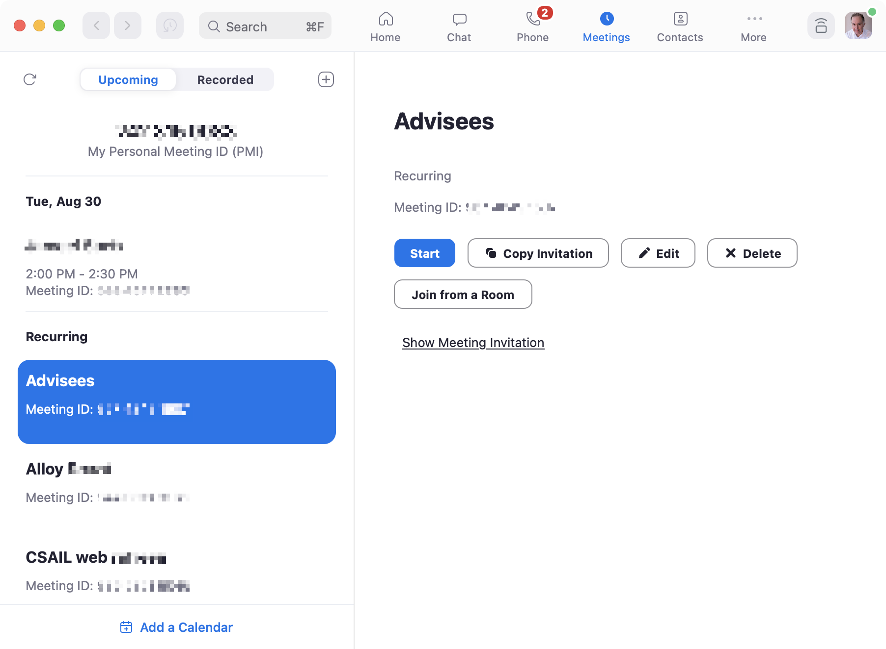

Sometimes an app would be enormously improved if a single essential concept were added. 

All email clients, for example, would benefit from a robust concept for identifying the people you communicate with. In Apple Mail, searching for messages from particular users is a nightmare: I type the user’s name into the search box and it matches multiple email addresses, which I then have to filter on one by one. And often even that fails to reveal the message I was looking for, because the *from* field of the message happened not to include the person’s name.

In this example, Apple is not to blame (although the design could surely be improved). Without a universal scheme (such as a public key infrastructure for email names and addresses), there’s no easy way to identify users. Even within a more closed network like Gmail you still have the problem of identifying users from outside the system.

It’s more surprising when a crucial concept is missing for no apparent reason. I’ve been thinking about Zoom recently and how, despite being a generally wonderful service, it has some design flaws that make the entire experience of using it much less pleasant.

# A new concept for Zoom

The missing concept that I have in mind might be called *MeetingList*. Its purpose would be to let you join meetings more easily, without having to store and recall a meeting identifier externally. The operational principles might be:

1. When you join a meeting, the meeting identifier is added to the meeting list, and after the meeting ends, you can restart or rejoin the meeting by clicking on it.
2. When you schedule an upcoming meeting, the meeting identifier is added to the list, and you can start or join when the time comes around by clicking on it.
3. If someone else schedules a meeting, they can send you the meeting identifier, and you can add the identifier to your meeting list, and then subsequently start or join by clicking on it.

This concept would surely not be difficult to implement. OPs (1) and (3) do suggest that a meeting identifier might carry (either within the identifier or by a binding in the cloud) the date and time, host and title of a meeting; OP (2) doesn’t require this, since the meeting has just been created by this user.

Zoom already includes a fledgling form of this concept that supports only OP (2), but it’s not very useful since only those meetings you happened to create yourself are included:

The fuller concept would offer many advantages:

- When a meeting ends prematurely, you would be able to rejoin easily without having to recall the meeting identifier.
- To join a meeting scheduled by someone else, you wouldn’t need to dig around in your email or calendar to find the link.
- Zoom could provide notifications for meetings about to happen; you wouldn’t need to rely on separate calendar notifications (or give Zoom access to your calendar, which only works anyway for Google and Outlook calendars).

This concept would be easy for users to understand; it’s a simple extension of the familiar *CallHistory* concept used by all communication apps (and by Zoom itself for its phone call feature).

# An Achilles heel for Zoom?

Including this concept might be important not only because it makes Zoom easier to use. Without it, Zoom is more vulnerable to competition from related products (such as Microsoft Teams, Google Meet and Apple FaceTime).

When Zoom first became popular, its concept of a meeting with a persistent identifier was critical to widespread adoption. Unlike other video calling apps at the time, notably Skype and FaceTime, you could connect with someone without them having to have an app installed and being ready to receive your call. You simply sent a URL containing the meeting identifier, and if they accessed it at a pre-arranged time, they could connect to you through the Zoom app in a browser. 

This was a brilliant idea, and made Zoom feel lightweight and easy. There was no commitment to a platform. In contrast, Teams (for example) required you to register an account and join a team, and it was hard to take calls in more than one team. A common piece of advice at the time recommended assigning a separate browser to each of your teams in order to work around bugs in switching between teams!

Since then, Microsoft has fixed many of the problems in Teams, and incorporated Zoom’s meeting identifier concept.

Zoom’s very advantage over its competitors—that it was easier to use because there was no platform commitment—may become its downfall. If users don’t have a way to manage all their Zoom meetings within Zoom itself, and have to resort to using external calendars and tools, Zoom becomes simply a video calling technology.

Zoom’s advantage in video quality (and better handling of bandwidth glitches) is shrinking as its competitors improve their technology. If Apple, Google and Microsoft continue to unify and integrate the features they offer within their own platforms, it will be easier and more tempting just to schedule meetings there, leaving Zoom out in the cold.

*This post was inspired by a discussion with [David Jackson](https://seekingalpha.com/author/david-jackson) who pointed out to me the risk of Zoom's lack of stickiness in its platform, which helped me understand the larger significance of a conceptual flaw that had always bothered me.*