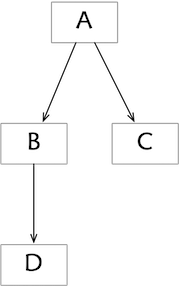
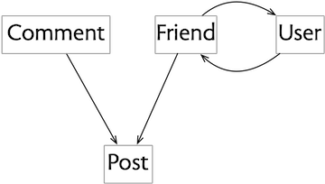

## An idea you need to know

One of the most important and useful ideas in software also happens to be one of the least well known. It was introduced in a [paper](https://ieeexplore.ieee.org/document/1702607) that [David Parnas](https://en.wikipedia.org/wiki/David_Parnas) wrote in 1979, entitled *Designing Software for Ease of Extension and Contraction*. 

**Program families**. Following on from an earlier paper that introduced the idea of “program families”---that when you design software you should realize that you’re designing a whole family of programs, not just one---this paper addresses the question of how to do this. How do you come up with one design that can be easily extended (by adding new functionality) or contracted (by removing functionality)?

**Four flaws**. Parnas starts with four flaws that make programs hard to extend or contract. Two are particularly relevant to concept design. One is having a component that serves two different functions. Concept design avoids this by demanding *specificity*: that each concept has only one purpose. The other is the presence of excessive dependencies. Concept design avoids this by requiring that there are *no* dependencies between concepts.

**The uses relation**. Parnas then introduces his big idea as a way to address these problems. He calls it the “uses relation.” Today we’d call it a *dependency diagram*.

**A snarky remark**. Even back in 1979, Parnas was aware of the fact that this idea was getting less attention than it deserved. He wrote rather snarkily:

> After studying a number of such systems, I have identified some simple concepts that can help programmers to design software so that subsets and extensions are more easily obtained. These concepts are simple if you think about software in the way suggested by this paper. Programmers do not commonly do so.

In writing this post, I hope to do my part in putting this right, albeit 40 years later!

## Defining subsets

**The dependency diagram**. Here’s the idea. Suppose our program has components A, B, C, D, etc. We draw a graph with components as nodes and an edge from one component *x* to another component *y* if any member of the program family that includes *x* must also include *y*. 

For example, in this diagram the edges from A to B and C mean that any program that includes A also includes B and C; and the edge from B to D means that any program including B includes D.

This diagram now implicitly defines a collection of subsets corresponding to each of the programs that might be built. So one subset, for example, is the program that contains only D; another contains B and D. On the other hand, B and C do not form a legitimate program, because any program containing B must also contain D.

Listing all the possible subsets, we get:

	{}, {C}, {D}, {B, D}, {C, D}, {B, C, D}, {A, B, C, D}

(I’ve rather pedantically included the empty subset, since it obeys the rules, but admittedly it’s not a very useful program.)

## Concept subsets

Let’s apply this idea to concepts. Suppose we have a social media app that has the following concepts: 

	Post: share content with others
	Comment: share reactions to content
	Friend: limit access to your content
	User: authenticate a participant

Now let’s construct the diagram by taking each of these concepts in turn and asking which other concepts it would require. 

This question is more subtle than it first appears to be, because it forces you to think about variants of a program that might be unfamiliar.

So we start with *Post*. Now you might assume that a post needs a user to author it. But that’s not true. It would be perfectly possible to have an app in which someone can create a post (and even write in their name as the author) without any kind of user authentication. Admittedly, this might not work too well for a large-scale social media app, but it might be just fine for a noticeboard inside an organization. (A puzzle for curious readers: what would the consequences be of not having a *User* concept if the *Post* concept included an *edit* action?)

The *Comment* concept is simpler. It clearly requires the *Post* concept, because if there are no posts, there’s nothing to comment on!

How about *Friend*? You might imagine that *Friend* could be present without *Post*, in an app that lets you navigate a graph of friendships independently of any content. And indeed, that’s how friending worked in the earliest social media apps (notably [Friendster](https://en.wikipedia.org/wiki/Friendster)). 

But the *Friend* concept that we’re familiar with (from Facebook) is a very different beast. Its purpose is to not support navigation through the graph of connections but to control access to content (and also to filter what content you see, although that’s arguably a different purpose that should be separated out). Moreover, if the *Friend* concept were to play the role it played in apps like Friendster, we’d need an additional concept to hold information about a user (such as *Profile* or *HomePage*), but no such concept is present in our design.

Consequently, *Friend* must require *Post*, because without content there can be no access to control. *Friend* also requires *User*, because it can’t work without authors of posts being authenticated.

Finally, *User* itself requires *Friend*, because without *Friend* there is no reason to include *User*. 

The resulting diagram looks like this:

## Using the dependency diagram

So now you have a dependency diagram, what can you do with it? 

**Clarifying the role of concepts**. First, let’s recognize that the construction of the diagram alone forced us to think hard about the role the concepts play in our design. If we’d just thrown the concepts together and not considered their dependencies, we would surely have realized that *Comment* builds on *Post*, but we might not have understood how *Friend* and *Post* are related. 

**Subsets: a family of programs**. One dependence diagram defines a collection of possible subsets. For our social media app, we have the following subsets

	1. {Post}
	2. {Comment, Post}
	3. {User, Friend, Post}
	4. {User, Friend, Post, Comment}

each corresponding to a different app:  (1) a noticeboard app in which people can post anonymous or unauthenticated messages; (2) the same app with comments; (3) a rudimentary social media app with user authentication and a friend network; (4) the same app with comments.

**Explanation order**. An advantage of using familiar concepts is that they don’t need to be explained to most users. But there will always be a need for training material that explains how to use an app, especially when the app is complex or contains novel concepts. Because concepts are freestanding and can be understood independently of one another, they can be presented separately.

But if you’re explaining concepts in some order, or encouraging users to learn them in some order, the diagram can suggest orders that make the most sense. The rule is that if concept A requires concept B, you want to explain B before A. So that means that an order such as

	<Post, Comment, Friend>

is good, but 

	<Friend, Comment, Post>
	
is less good, because the *Friend* concept isn’t motivated until you see *Post* (when you can explain that the idea is to share posts with your friends), and likewise *Comment* doesn’t make sense until you’ve seen *Post*.

Note, by the way, that the mutual relationship between *Friend* and *User* means that there’s no order of one concept at a time that satisfies the rule: those two have to be explained together.

## Intrinsic dependencies

**Concrete descriptions**. Let’s move to thinking of software components not in terms of abstract functionality but in terms of their description, whether some text describing a component at the design level, or some code that implements a component.

**Intrinsic dependencies**. Now the possibility arises that a component contains an explicit reference to another component. At the abstract level, its design mentions the other component; or at the code level, it makes a call to it (for example). I call such a dependency an “intrinsic dependency” because it’s part of the component itself rather than a property of the overall design. When is such a dependency legitimate?

**Parnas’s rule**. In his paper, Parnas gives the following rule: if a component A has an intrinsic dependency on a component B, then there should be no plausible subset that contains A but not B.

That sounds complicated, but it’s really very simple. Putting it more simply:

	If you can’t use A without B, you should never want to use A without B.

**The uses relation**. True confessions: Parnas doesn’t start with the interpretation of the diagram that I started with. In fact, he follows exactly the reverse path. He suggests that you construct a “uses relation” with an edge from A to B whenever A *uses* B (that is, has an intrinsic dependency on it). The diagram you obtain from this then defines the subsets that are actually *possible*; you then check it to see if they are *desirable* (or more accurately that some important subsets are *not possible*).

**Example of bad code**. For example, suppose we were building our social media app in an object-oriented style, and we defined two classes *Post* and *Comment* that implemented those concepts. Now suppose that each post contained a list of the associated comments:

	class Post {
	  List<Comment> comments;
	  ...
	  }

This is, in fact, the way many inexperienced programmers might write this code. Notice that this introduces an intrinsic dependency of *Post* on *Comment*. According to Parnas’s rule, that means there should be no variant of the app in which there are posts but no comments.

Clearly that’s absurd! The intrinsic dependency is exactly the wrong way round. If there were to be a dependency, it should be of *Comment* on *Post*, and not *Post* on *Comment*.

Unfortunately, achieving that is not so easy in OOP. The problem is that dependencies tend to follow the direction of data navigation, and since the programmer will likely want to go from a post to its associated comments (so they can displayed along with the post), the dependency goes in that direction too.

There are various ways around this in OOP, but that’s another subject. So I’ll just point out here that the problem doesn’t arise in a relational setting, in which the *Post* and *Comment* concepts are implemented as modules each with their own database tables. The *Comment* concept can then hold a table mapping posts to comments, and navigating from a post to its comments just involves performing a relational join.

**Applying this to concepts**. Back to concepts. Unlike many other kinds of software modules, concepts are always [independent](https://essenceofsoftware.com/tutorials/concept-basics/criteria/), so there are no intrinsic dependencies. That’s why I started with subset interpretation of the dependency diagram: it’s the only one that matters. 

**Independent? What?**. Aren’t I contradicting myself? I’ve just said that concepts are always mutually independent, but doesn’t the dependency diagram show dependencies? The resolution of this apparent contradiction is that we’re talking about two different kinds of dependencies. Concepts have no *intrinsic* dependencies, but they have dependencies in the *context* of the application design.

So the *Comment* concept has no intrinsic dependence on the *Post*. To understand comments, you don’t need to know about posts. This is achieved by describing the *Comment* concept generically in terms of some arbitrary targets that comments can point to; they could be posts, but they could also be newspaper columns or answers in a Q&A forum. In computer science lingo, *Comment* is *polymorphic*.

But in the context of our social media app, including the *Comment* concept makes no sense without the *Post* concept, because there aren’t any other suitable targets for the comments. So there is an *extrinsic* dependency of *Comment* on *Post*, but not an intrinsic one.

**A parting thought**. Lest you imagine that intrinsic dependencies are simple, let me make your life a bit harder. When you try to pin down exactly what it means for one component to “use” another, most simple attempts fail. You might start by saying that A uses B if A makes a call to B. But then a round-robin scheduler that calls each of its tasks in turn “uses” those tasks (even though it’s actually the tasks that depend on the scheduler). In a [paper](https://groups.csail.mit.edu/sdg/pubs/2020/demystifying_dependence_published.pdf) I wrote with [Jimmy Koppel](https://www.jameskoppel.com), we present a collection of such puzzles, and suggest some ideas for a more robust notion of intrinsic dependency.
