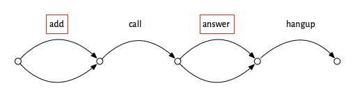

# Scenarios of software success

If we want to make software that’s successful, it helps to start by looking at examples of success. So we’ll consider some well known examples and try and identify what made them succeed: their secret sauce. 

When you try to figure what made some app super successful, and you ask users why they like it, they’ll often say “because it just works.” Uncovering what this is about---what “just working” really means---is not so easy, but I think it’s possible to identify the key elements of “just working” and I’ll lay them out here.

# How Zoom killed Skype
In 2019, Skype had four billion registered users, and about a third of the video call market. Then the pandemic hit. Zoom, a product few had even heard of, took off and “zooming” became a household word. By 2021, Zoom had half the video call market and almost a billion dollars in revenue, and Skype has receded out of view.

Zoom is one of those apps that people say “just works.” Let’s think about how Zoom works, from a user’s perspective. You *create* a meeting, which generates a link you share with your friends. Then, you *start* the meeting and your friends can *join* in their own time, using the link you gave them. When you’re done, you *end* the meeting. We can depict this scenario in a diagram showing the actions taken, with forking arrows in the joining step to suggest that multiple people can join in whatever order:

Now compare this to using Skype. To set up a group video call in Skype, you *add* each of your friends to the group, then you *call*, some of them *answer*, and then you *hangup*:

At first blush, this doesn’t look any worse. It’s not more complicated in terms of the number of steps or the structure of the scenario. The problem is that some of the steps, which I’ve outlined with red boxes, are painful. Adding your friends means going through your contact list and finding them one at a time. If one of your friends isn’t in your contact list, you’ll have to get their contact info and include it. Even worse, if one of your friends isn’t a Skype user, you won’t be able to invite them at all. The answer step isn’t so easy either. Your friend has to open the app and either be there at the moment that your call comes in, or has to find a notification that they missed.

Now, you might say this is all silly. If you just want to talk to two friends and they’re already on Skype, it will work just fine. And you’re probably right. But what happened in the pandemic was that things changed, and suddenly people wanted to talk to all kinds of different groups of people---friends, colleagues, neighbors---and in larger numbers than before. So the small annoyances of Skype became huge barriers.

In that context, Zoom’s solution was what my colleague Merrick Furst [calls](https://www.amazon.com/Heart-Innovation-Navigating-Authentic-Demand/dp/152300570X) a “not not.” It was *not* OK to *not* have the Zoom scenario, which allowed you to organize  a meeting merely by sharing a link, and to join a meeting just by clicking on it, whether or not you had a Zoom account.

# Not quite so simple

Now you may be thinking: that’s not the whole story. And you’d be right. The switch from Skype’s *video call* scenario to Zoom’s *meeting* scenario wasn’t so sudden or clear cut.

The Zoom idea (having a meeting link created asynchronously in advance) might have originated with LogMeIn in 2010, a company that built a video conferencing solution that was aiming to be much more lightweight than existing offerings from companies like Citrix. Zoom used this idea from its founding in 2012, but by 2020, it wasn’t the only company to have recognized its value. Skype added meeting links in 2015, and Google Hangouts had them a year later.

But in both those cases, the idea was integrated half-heartedly. It wasn’t the default way to start a meeting. In Skype you couldn’t link to a video call directly (but only to a chat, from which a video call could be launched). And in Hangouts, although the host could admit users without accounts, they had to be approved (as in Zoom’s “waiting room”), a nuisance for a large (and not private) meeting.

There are other complications too. Zoom’s success undoubtedly benefited from the ease of installing the app, which relied in part on disreputable techniques (learned these from malware developers) for working around operating system protections that would have required additional approval steps from the user. Zoom also lied about end-to-end encryption. These factors seems smaller, however, than the others.

# What “just works” means

With all this in mind, we can now pose the question: what did people mean when they said that they switched to Zoom because it “just works”?

First, it seems to me, “just working” applies to products that one expects to be targeted at a relatively simple purpose and to work in a (correspondingly) uncomplicated way. A video calling app fits these criteria, but not a photo editing app. I don’t think anyone expects that Photoshop should “just work.”

Second, it means that the product should have a clear and compelling usage scenario: that it’s obvious what steps you have to take, and in what order. Zoom makes this very easy, because there are so few steps, and at any time, you have very few options. So having created meeting, you can’t do much except start it; and having started or joined it, there’s nothing to do except leave. (Of course, there are other actions you can take, like muting your microphone, but it’s pretty obvious that those are orthogonal to the main meeting scenario).

Third, when you execute the scenario you shouldn’t encounter pain points, like having to find contacts to add to a group call in Skype, or having to open an account to respond to a call invitation.

# Just So Stories

Merrick Furst, whom I mentioned earlier for his idea of “not nots” is skeptical of what he calls “just so stories” that present supposedly compelling explanations of why some innovation succeeded or failed. It’s a great term, harking back to Rudyard Kipling’s children’s stories that [according to](https://en.wikipedia.org/wiki/Just_So_Stories) the biologist Lewis Held “offered fabulous tales about how the leopard got its spots, how the elephant got its trunk, and so forth” and that, despite being wonderfully entertaining, were “poor substitutes for real understanding.”

It’s possible that my explanation of Zoom’s dominance is a just so story, and in giving some of the more complex background, I’ve suggested that the real story isn’t as simple as it might first seem to be. It’s possible that Zoom simply reached a tipping point and became dominant due to the [network effect](https://en.wikipedia.org/wiki/Network_effect), for example.

But here’s the nub of it. This would be more of a problem if my goal were to give you a way to determine reliably whether a particular company’s innovation will fail or succeed in the marketplace. 

My goal instead is to find ways to improve the design of software, and from that perspective the Zoom vs Skype story seems to me on much more solid ground. Whether or not Zoom succeeded with its meeting scenario is not so crucial. What matters is that this design, in which a link is sent asynchronously, must be recognized---in the context of the emergence of larger, ad hoc video calls---as hugely superior to the design in which participants are invited directly as existing users of a platform.

# Design is necessary but not sufficient

One final response to another possible skepticism. Some might say that none of this design stuff matters if the software isn’t reliable, scalable, performant, etc.

The answer to this objection is easy: yes. Design is necessary but not sufficient. Just as great architecture won’t make a building successful if the civil engineers fail to ensure that it can withstand the wind, so a well-designed software product can’t succeed without good software engineering.

That doesn’t mean design doesn’t matter, or that design doesn’t have a big impact on these other factors; it just means that design isn’t everything. But to those of us who are designers, it might be still be the most enjoyable and exciting thing...

