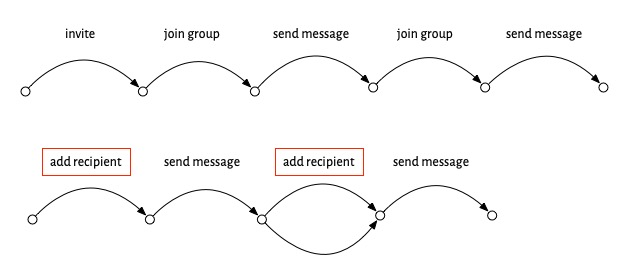

*For a video version of this post, see my recent [TEDx talk](https://www.youtube.com/watch?v=LtvkRJuMa6A).*

_Now [translated into Japanese](https://bonotake.hatenablog.com/entry/2024/04/05/150812) by Takeo Imai!_

# Diagnosing software success

If you want to make software that’s successful, it helps to start by looking at examples of success. In this post, I look at one well-known example and try and identify what made it succeed---its secret sauce---and then show how the same strategy can be applied to similar successes.

When you try to figure what made some app super successful, and you ask users why they like it, they’ll often say “because it just works.” Uncovering what this is about---what “just working” really means---is not easy, but it’s possible to identify the key elements of “just working” and I’ll do that later.

# How Zoom killed Skype
In 2019, Skype had four billion registered users, and about a third of the video-call market. Then the pandemic hit. Zoom, a product few had even heard of, took off and “zooming” became a household word. By 2021, Zoom had half the market and almost a billion dollars in revenue, and Skype had receded out of view.

Zoom is one of those apps that people say “just works.” To explore this, let’s think about *how* Zoom works, from a user’s perspective. You *create* a meeting, which generates a link you share with your friends. Then, you *start* the meeting and your friends can *join* in their own time, using the link you gave them. When you’re done, you *end* the meeting. We can depict this scenario in a diagram showing the actions taken, with forking arrows in the joining step to suggest that multiple people can join in whatever order:

Now compare this to using Skype. To set up a group video call in Skype, you *add* each of your friends to the group, then you *call*, some of them *answer*, and then you *hangup*:

At first blush, this doesn’t look any worse. It’s not more complicated in terms of the number of steps or the structure of the scenario. The problem is that some of the steps, which I’ve outlined with red boxes, are painful. The *add* step means going through your contact list and finding them one at a time. If one of your friends isn’t in your contact list, you’ll have to get their contact info and include it. Worse, if one of your friends isn’t a Skype user, you won’t be able to invite them at all. The *answer* step isn’t so easy either. Your friend has to open the app and either be there at the moment that your call comes in, or has to find a notification that they missed.

Now, maybe you’re thinking this makes a mountain out of a molehill. If you just want to talk to two friends and they’re already on Skype, it will work just fine. And you’d be right. But what happened in the pandemic was that things changed, and suddenly people wanted to talk to all kinds of different groups of people---friends, colleagues, neighbors---and in larger numbers than before. So the small annoyances of Skype became huge barriers.

In that context, Zoom’s solution was what my colleague Merrick Furst [calls](https://www.amazon.com/Heart-Innovation-Navigating-Authentic-Demand/dp/152300570X) a “not not.” It was *not* OK to *not* have the Zoom scenario, which allowed you to organize  a meeting merely by sharing a link, and to join a meeting just by clicking on it, whether or not you had a Zoom account.

# Not the whole story

That’s not the whole story, of course. The switch from Skype’s *video call* scenario to Zoom’s *meeting* scenario wasn’t so sudden or clear cut.

The Zoom idea (having a meeting link created asynchronously in advance) might have originated with LogMeIn in 2010, a company that built a video conferencing solution that was aiming to be much more lightweight than existing offerings from companies like Citrix. Zoom used this idea from its founding in 2012, but by 2020, it wasn’t the only company to have recognized its value. Skype added meeting links in 2015, and Google Hangouts had them a year later.

But in both those cases, the idea was integrated half-heartedly. It wasn’t the default way to start a meeting. In Skype you couldn’t link to a video call directly (but only to a chat, from which a video call could be launched). When Skype realized this (belatedly, in April 2020), they added a new feature called Meet Now that allowed direct links to video calls. And in Hangouts, although the host could admit users without accounts, they had to be approved (as in Zoom’s “waiting room”), a nuisance for a large (and not private) meeting.

There are other complications too. Zoom’s success undoubtedly benefited from the ease of installing the app, which relied in part on disreputable techniques (learned these from malware developers) for working around operating system protections that would have required additional approval steps from the user. Zoom also lied about end-to-end encryption. 

None of these complications, however, obscures the fact that Zoom offered a scenario---a pattern of interaction---that was a better match to what users needed than its competitors.

# What “just works” means

With all this in mind, we can now address the question: what did people mean when they said that they switched to Zoom because it “just works”?

- **A compelling scenario**, so  that it’s obvious what steps you have to take, and in what order. Zoom makes this easy, because there are so few steps, and at any time, you have very few options. Having created meeting, you can’t do much except start it; and having started or joined it, there’s nothing to do except leave. (Of course, there are other actions you can take, like muting your microphone, but it’s pretty obvious that those are orthogonal to the main meeting scenario).
- **No pain points** when you execute the scenario, like having to find contacts to add to a group call in Skype, or having to open an account to respond to a call invitation.
- **A simple purpose**, against which an app can be readily judged. For Zoom, that purpose was opening a video call with multiple participants. Not all apps have such a unitary purpose; Photoshop, for example, fulfills so many different and intricate purposes that I doubt anyone expects it to “just work.”

# Just So stories

Merrick Furst, whom I mentioned earlier for his idea of “not nots” is skeptical of what he calls “just so stories” that present supposedly compelling explanations of why some innovation succeeded or failed. It’s a great term, harking back to Rudyard Kipling’s children’s stories that [according to](https://en.wikipedia.org/wiki/Just_So_Stories) the biologist Lewis Held “offered fabulous tales about how the leopard got its spots, how the elephant got its trunk, and so forth” and that, despite being wonderfully entertaining, were “poor substitutes for real understanding.”

It’s possible that my theory of Zoom’s rise is a “just so story.” Perhaps that Zoom simply reached a tipping point and became dominant due to the [network effect](https://en.wikipedia.org/wiki/Network_effect), for example.

But here’s the nub of it. If my goal were to give you a way to determine reliably whether a particular company’s innovation would fail or succeed in the marketplace, this might be fatal.

My goal instead is to find ways to improve the design of software, and from that perspective the Zoom vs Skype story seems to me on solid ground. Whether or not Zoom succeeded *because* of its meeting scenario is not so crucial. What matters is that it succeeded *with* this scenario. This design, in which a link is sent asynchronously, can be recognized---in the context of the emergence of larger, ad hoc video calls---as far superior to the design in which participants are invited directly as existing users of a platform.

# More examples

Two more examples of this idea. Apple’s iPod was sleeker than existing MP3 players when it came out in 2001, but it didn’t explode until a few years later. One crucial innovation might explain this: the opening of the iTunes store (in 2003). The scenario upgrade was from having to rip CDs (or worse find pirated songs online) to a being able to buy single songs, sync them to your device and play them immediately:

Walter Isaacson [credits](https://en.wikipedia.org/wiki/Steve_Jobs_(book)) Steve Jobs with the crucial insight here, and marvels at how nobody else saw this opportunity (especially Sony, which not only lead in consumer electronics but also had its own music studios).

WhatsApp was founded in 2009, but its meteoric rise began in 2011. End-to-end encryption was still five years away, and free texting had been around since 2006. So what happened in 2011? In short, group chat, so that rather than having to add recipients one at a time to each thread, you could invite your friends to join a group, and then all your messages would be shared with whoever had joined:

[Other companies](https://www.nytimes.com/2011/03/11/technology/11group.html) were trying to capitalize on group chat at the same time, but WhatsApp was the clear winner, perhaps because it already had a strong user base.

# Lessons

In some sense, the key point here is unsurprising: people adopt new tools that change their pattern of behavior,  by making it simpler and by eliminating pain points.

But despite its simplicity, this idea has some major ramifications for software:

- **Scenarios explain software**. Software apps, like other innovations, can be explained by usage scenarios. These scenarios aren’t the mundane use cases or user stories that we’re familiar with; they’re more like Michael Polanyi’s [operational principles](http://www.polanyisociety.org/mp-structure.htm) that capture the very essence of a machine’s design.
- **Innovation = scenario change**. Bruno Latour [explains](http://www.bruno-latour.fr/node/258.html) the emergence of technology in a similar way. Without doors, you’d have to break a hole in a wall every time you leave a building, and patch it on your return: hardly convenient. When a software scenario looks simple or trivial, appreciating it may require comparison to what came before.
- **Simplicity matters**. Don Norman taught us that even knowing how to [operate a door](https://normandoors.tumblr.com) can be hard. For software, many pitfalls lie between the basic scenario and its realization in the context of a user interface. If the scenario isn’t conveyed clearly and easy to execute, it might as well not exist.

The lesson for any start-up, in short, is: **know your scenario**. And make sure you don’t get distracted and that you focus on delivering it as directly and compellingly as you can.

But what about more complex apps that seem to embody multiple scenarios? That’ll be the topic of my next post.